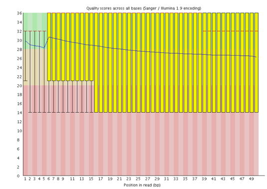

Step 1: Quality Control and Read Trimming
================

-   [Overview](#overview)
-   [FastQC](#fastqc)
    -   [Load fastqc using `module`](#load-fastqc-using-module)
    -   [FastQC in the Command Line](#fastqc-in-the-command-line)
    -   [Export and view your fastqc
        results](#export-and-view-your-fastqc-results)
    -   [Interpreting your fastqc results & selecting
        parameters](#interpreting-your-fastqc-results--selecting-parameters)
        -   [Basic statistics](#basic-statistics)
        -   [Per base sequence quality](#per-base-sequence-quality)
        -   [Per tile sequence quality](#per-tile-sequence-quality)
        -   [Per sequence quality scores](#per-sequence-quality-scores)
        -   [Per base sequence content](#per-base-sequence-content)
        -   [Per sequence GC content](#per-sequence-gc-content)
        -   [Per base N content](#per-base-n-content)
        -   [Sequence length
            distribution](#sequence-length-distribution)
        -   [Sequence duplication levels](#sequence-duplication-levels)
        -   [Overrepresented sequences](#overrepresented-sequences)
        -   [Adapter content](#adapter-content)
-   [Quality Trim with Trimmomatic](#quality-trim-with-trimmomatic)
    -   [Load Trimmomatic using
        `module`](#load-trimmomatic-using-module)
    -   [Batch-trimming using `bash`
        script](#batch-trimming-using-bash-script)
        -   [Parameter options](#parameter-options)
        -   [Executing your script](#executing-your-script)
-   [FastQC Round 2](#fastqc-round-2)
-   [Next steps](#next-steps)

## Overview

RNA sequencing is imperfect. Many different things can go wrong, such as
a malfunctioning sequencer or contamination from the environment. Other
times, certain errors are typical and even expected from RNA sequencing
in particular. As a result, the reads that come from the sequencer
aren’t typically used in their raw form. The raw `.fastq` or `.fq` files
(sometimes `.zip` or `.gz` compressed, which is also fine) conveniently
contain the sequences with quality scores assigned to each base. The
first step is to assess the quality of the reads and to remove the
portions that aren’t high quality. The results of this step are
visualizations of the read quality statistics as well as new “quality
trimmed” reads which will be used in the [alignment and quantification
step](Step_2_AbundanceQuant.md).

**Please note**: the following assumes a working familiarity with
navigating the command line and Discovery. If you need practice with
these concepts, please find the relevant lessons in the Intros to Coding
folder on the lab GitHub page before attempting this work.

## FastQC

#### Load fastqc using `module`

Once your raw read files are finished uploading (see [Getting
Started](GettingStarted.md)), the next step is quality control. Make
sure you’re in the folder with the raw reads by using `pwd`.

Use `module avail` to see the software available for use. You should see
`fastqc` in this list. To add `fastqc` to your path:

``` bash
# You might get an error prompting you to also load oracle_java.
# In that case, first use 'module load oracle_java' before loading fastqc
$ module load fastqc
```

You can confirm `fastqc` was properly loaded with `$ module list`.

#### FastQC in the Command Line

Next is to use this module to get an idea of the parameters we should
choose for the quality trimming step. Run `fastqc --help` to open up the
help page for `fastqc` and see your options.

-   `-o` or `--outdir` followed by your desired output directory will
    specify that `fastqc` dumps the results into a particular location.
    Use `../results` for this (assuming you created a `results` folder
    above). You can also create a subdirectory of `fastqc_results` if
    you want.
-   If you have an alternative file than `.fastq.gz`, `.fastq`, or
    `.fq`, you can specify this with the `-f` or `--format` flag.
-   `-t` or `--threads` can speed up your job by putting it in parallel.
    You can use a maximum of 4 threads here.
-   `-q` or `--quiet` will suppress any output to the command line. You
    will have no indication of the progress of the command if you use
    this.

If you want to be really thorough, you can generate a QC report for
every file. I wouldn’t recommend doing this outside of a script.
Instead, you can specify just a few files.

``` bash
# You can include however many file names you feel like in order 
$ fastqc <file-one> <file-two> -t 4 -o ../results/

# IF you wanted to do ALL files (change extension as needed):
$ fastqc *.fastq.gz -t 4 -o ../results/
```

You will see output in your command line as this progresses, and you
won’t be able to do anything in this window for the time being. For a
handful of files this won’t take long, so sit tight. Once your `fastqc`
has finished, you should confirm that you see `.html` files for your
input files in your `results` directory.

#### Export and view your fastqc results

You can’t view the `.html` files directly on Discovery, so you have to
move them to your local computer. On your local computer, open a new
Terminal or MobaXTerm window (you don’t have to close your Discovery
window). Use `cd` to navigate to your desired location.

In your Discovery window, navigate to your `results` folder with the
`.html` report files. Use `pwd` to get the path to the `.html` files.

Then, back in your *local* window:

``` bash
# The * is a wildcard so ALL .html files in the results folder will be transferred
# The "." at the end indicates your local working directory. If you're not where you
# want to dump your files, you'll have to specify the path or move there and then use ".".
$ scp <username>@xfer.discovery.neu.edu:/path/to/fastqc/results/*.html .
```

You can confirm that the files have transferred by checking your
destination folder in your file browser.

### Interpreting your fastqc results & selecting parameters

In your results `.html` file you will see several sections:

<!-- -->

Here I will break down each one of these sections, what they’re telling
you, what “good” and “bad” data looks like, and how these inform the
selection of your [quality trimming
parameters](#quality-trim-with-trimmomatic). This information comes from
[the FastQC
documentation](https://www.bioinformatics.babraham.ac.uk/projects/fastqc/Help/).
**NOTE:** A yellow *warning* or red *failure* does not necessarily
indicate bad data! In fact, there are certain errors that are expected
for RNA sequencing.

The FastQC website provides examples of both
[good](https://www.bioinformatics.babraham.ac.uk/projects/fastqc/good_sequence_short_fastqc.html)
and
[bad](https://www.bioinformatics.babraham.ac.uk/projects/fastqc/bad_sequence_fastqc.html)
results for these modules if you’re uncertain of what to look for.

#### Basic statistics

<!-- -->

Exactly as it sounds, the basic statistics section will provide a
general overview of your data. Make note of the *Encoding* section
because it may relate to your trimming in select cases. Additionally,
note the *Sequences flagged as poor quality* and *%GC* sections as well.

-   **Warning:** Never raises a warning.
-   **Failure:** Never raises an error.

#### Per base sequence quality

<!-- -->

These are boxplots of the quality scores attached to each base pair at
different positions in the sequence, with the y-axis representing
quality scores and the x-axis indicating position in the sequence. It is
normal for quality to drop off by some amount at the end of the
sequence. Make note of where the quality dips into the yellow and red;
this will inform how much of the end of the sequence you trim off. You
can also trim the beginning of the sequence if the quality is poor
here. - **Warning:** will occur if the lower quartile for any base is
less than 10 or if the median is less than 25. - **Failure:** will occur
if the lower quartile for any base is less than 5 or if the median is
less than 20.

From [this HBC training module on
FastQC](https://hbctraining.github.io/Training-modules/planning_successful_rnaseq/lessons/QC_raw_data.html),
here are some common failures: <!-- -->
<!-- --> <!-- -->

The failure profiles above all warrant contacting your sequencing
facility due to issues with the instrumentation. Similarly, if there is
consistently low quality across the read, this could be due to
overclustering of the flow cell.

Here’s a “normal” profile from [this MSU
tutorial](https://rtsf.natsci.msu.edu/genomics/tech-notes/fastqc-tutorial-and-faq/),
which I’ll use to demonstrate how to choose some trimming parameters:
<!-- -->

Most of this read is high quality. It might be worth trimming the first
3-5 nucleotides, but would also be acceptable to not trim anything from
the beginning of the read. This will be your `LEADING` number. At the
end of the read, we see that quality begins to drop off near 130 or so,
but the lower quartile only enters the yellow at the very end. For this
read, then, your `TRAILING` number might be 5 or 10, but it would again
be acceptable to not trim any at all.

#### Per tile sequence quality

<!-- -->

This graph is applicable only if your Illumina sequences have their
sequence identifiers still attached. The picture above, from the FastQC
documentation, shows a heatmap of average tile quality. The warmer the
color (reds and yellows), the lower the tile quality. A “good” heatmap
will be blue in all tiles. This allows you to see if parts of the
flowcell had any problems, such as debris. These issues are most common
when the flowcell is overcrowded, and might be fine if only a handful of
tiles are affected.

-   **Warning:** will occur if the quality is over 2 less than the
    average quality for that base across all tiles.
-   **Failure:** will occur if the quality is over 5 less than the
    average quality for that base across all tiles.

#### Per sequence quality scores

<!-- -->

This graph plots read length (y-axis) versus average quality score for
the whole read (x-axis). A good graph will show mostly high-quality
sequences. If there are a lot of sequences with low quality, there may
have been a problem with sequencing (and other modules may give more
information as to what went wrong). Depending on what happened, you may
be able to overcome issues with quality trimming.

-   **Warning:** will occur if the mean quality is most frequently under
    27.
-   **Failure:** will occur if the mean quality is most frequently
    under 20. This represents a 1% error rate. Given that there are
    thousands upon thousands of sequences, this error adds up *very*
    quickly.

#### Per base sequence content

<!-- -->

This graph reports the percent of each DNA base (y-axis) that occurs at
each base position of a read (x-axis). The lines should be relatively
parallel, and around the same % for each base pairing (i.e., C to G and
A to T).

<!-- -->

The above graph shows what normally occurs with RNA Sequencing data.
This section will likely show a warning or failure if you are working
with RNA-Seq reads, due to the random hexamer priming that occurs in
library preparation. This *sequencing bias* can’t really be overcome
with quality trimming, but it also has little impact on your analysis
and can sometimes be overcome in later quantification steps. Other
warnings may arise from [overrepresented
sequences](#overrepresented-sequences), sodium bisulphite libraries, and
adapter-trimmed reads.

-   **Warning:** will occur if the % difference between A and T or G and
    C is greater than 10 anywhere.
-   **Failure:** will occur if the % difference between A and T or G and
    C is greater than 20 anywhere.

#### Per sequence GC content

<!-- -->

This graph shows the GC content across each sequence along with a normal
distribution. The normal distribution is calculated from the sequence
data, rather than from any reference genome. If the actual distribution
(in red) is not relatively normal, there may have been some
contamination or bias. Sharp peaks in the distribution may represent
specific contamination, while broad peaks may be contamination by other
species’ sequences.

-   **Warning:** will occur if there is a greater than 15% deviation
    from the normal distribution.
-   **Failure:** will occur if there is a greater than 20% deviation
    from the normal distribution.

#### Per base N content

<!-- -->

Sequencing involves, basically, a statistical determination of what each
base “really” is. When the sequencer is unable to confidently say what
base is at a certain position, that base is given an “N” rather than one
of “ATGC”. This graph therefore shows where along each read there are
“N”s. There is typically some amount of “N”s towards the very beginning
or end of a read, but too many suggests that the sequencer was
struggling to determine the bases for one reason or another. In
conjunction with the other modules, you may be able to determine if
there was overcrowding on the flow cell or some other reason for a
decrease in quality.

-   **Warning:** will occur if N content goes above 5%.
-   **Failure:** will occur if N content goes above 20%.

#### Sequence length distribution

<!-- -->

Not all sequencers produce reads of the same length. Typically, as
above, you will see a graph with only one sharp peak. However, sequences
may be of varying lengths and so warnings can usually be ignored.

-   **Warning:** will occur if not all sequences are the same length.
-   **Failure:** will occur if any sequences are “0” in length.

#### Sequence duplication levels

<!-- -->

During library preparation, sequences are amplified by PCR to get high
enough coverage for the sequencer to have the statistical power to make
base calls. Sequences should most often only occur once in each final
library, so high duplication levels indicates sequencing bias. This
module only samples the first 100,000 sequences in each file, truncated
to 50 base pairs, to get an idea of this duplication. You should see
peaks in the far left of the plot, indicating low duplication. The
percentage at the top of the chart shows the loss in the library after
sequences are deduplicated.

There are several reasons for duplicate sequences, one of which may be
from biological replicates. FastQC has no way to determine which is
which, so sometimes you can ignore these warnings. RNA-Seq, ChIP-Seq,
and small RNA libraries often show warnings due to the nature of their
library preparation, and these can usually be ignored.

-   **Warning:** will occur if more than 20% of sequences are
    duplicated.
-   **Failure:** will occur if more than 50% of sequences are
    duplicated.

#### Overrepresented sequences

This module is a list of sequences making up greater than 0.1% of the
first 100,000 sequences truncated to 50 base pairs. It also may give you
possible contaminants creating these sequences; this doesn’t mean that
*is* the contaminant, but gives you a general idea. This module may also
return your adapter sequence. This module often reports warnings for
small RNA libraries.

-   **Warning:** will occur if a sequence makes up more than 0.1% of the
    total.
-   **Failure:** will occur if a sequence makes up more than 1% of the
    total.

#### Adapter content

<!-- -->

This plot shows the reads where adapters from the library prep are
represented in your reads. Illumina data often doesn’t have any, but in
RNA-Seq libraries there may be some of these inserts towards the end of
the read, as seen above. If you receive a warning or failure, you may
need to adapter trim your reads. This is handled with the `ILLUMINACLIP`
option in quality trimming.

-   **Warning:** will occur if an adapter sequence is in more than 5% of
    reads.
-   **Failure:** will occur if an adapter sequence is in more than 10%
    of reads.

## Quality Trim with Trimmomatic

Now that you’ve gone through the FastQC modules, you should have a good
idea of the quality of your reads and where they can be improved. This
“improvement” comes in the form of quality trimming. Quality trimming
removes low-quality areas of reads, and may also remove adapter
sequences. The results of this step will be two directories of `Paired`
and `Unpaired` reads (your raw reads will also still be present).

#### Load Trimmomatic using `module`

Trimmomatic is available pre-installed Discovery, which you can confirm
using `module avail`. As with FastQC, use:

``` bash
$ module load trimmomatic
```

You can confirm that `trimmomatic` was properly loaded using
`module list`. Again, you might need to first do
`module load oracle_java` before loading Trimmomatic.

#### Batch-trimming using `bash` script

Now for actually trimming your reads. Manually trimming each read
one-by-one in the command line would be really annoying, so instead
we’ll write a script to do all of them the same way. Below is a script
for the basic setup, but **please** read carefully and edit the
parameters to make relevant to your data. There is also a copy of this
script in the `scripts` directory that you can download and `scp` to
Discovery.

First, create your script using Vim.

``` bash
# You can name it whatever you want
$ vim trimmomatic.sh
```

Once in Vim, hit `i` to enter `Insert` mode. Insert the following
(including the `#!/bin/bash` and `SBATCH` parameters at the top) and do
**NOT** leave extra (>1) spaces at the end of any lines. Trust me when I
say that trailing spaces are one of the most frustrating mistakes to
make. See below the script for details on the parameters that you can
change; you can also run `trimmomatic --help` in your command line for
additional documentation.

``` bash
#!/bin/bash
#SBATCH --time=8:00:00
#SBATCH --partition=short
#SBATCH --job-name=Trimming
#SBATCH --nodes=1

# trimmomatic.sh
# This script uses Trimmomatic to quality trim raw reads in the working directory

# You can delete these lines if you've already loaded the modules
# I like to leave them in just in case you forget to though
module load oracle_java
module load trimmomatic

# Initializing variable for path to fastq files
# Replace with the absolute path to your untrimmed files
raw_file_path="/path/to/untrimmed_files/"

# Initializing variable for the suffixes of the raw reads
# If your suffixes are different, edit this to match
left_suffix="_R1_001.fastq.gz"
right_suffix="_R2_001.fastq.gz"

# Initializing output directories
# Change the paths to where you want your output files to go
paired_out="/path/to/paired/output/"
unpaired_out="/path/to/unpaired/output/"

# Creating output directories
mkdir -p $paired_out
mkdir -p $unpaired_out

# Creating trimming function to perform on all reads
function trim_reads {
    # Looping over all left reads in the raw files. "*" is a wildcard, do NOT remove
    for left_read_file in $raw_file_path*$left_suffix
    do
        # Removing the path from the file name and assigning to a new variable
        no_path="${left_read_file/$raw_file_path/}"
        # Removing suffix from the file name and assigning to new variable
        sample_name="${no_path/$left_suffix/}"
        # This line calls the actual Trimmomatic module
        # Parameters are described in Step_1_QualityTrimming.md on lab GitHub page
        # DO NOT DELETE any of the "\"
        java -jar /shared/centos7/trimmomatic/0.39/trimmomatic-0.39.jar PE \
        -threads 1 -phred33 \
        $raw_file_path$sample_name$left_suffix \
        $raw_file_path$sample_name$right_suffix \
        $paired_out$sample_name$left_suffix \
        $unpaired_out$sample_name$left_suffix \
        $paired_out$sample_name$right_suffix \
        $unpaired_out$sample_name$right_suffix \
        HEADCROP:0 \
        ILLUMINACLIP:/shared/centos7/trimmomatic/0.39/adapters/TruSeq3-PE.fa:2:30:10 \
        LEADING:3 TRAILING:25 SLIDINGWINDOW:4:30 MINLEN:36
    done
}
trim_reads
# ^ we need to call the function with "trim_reads" here, otherwise nothing will happen
```

##### Parameter options

Within the script above, there are a number of changes you can make to
suit your needs. If you need more information, visit the [Trimmomatic
documentation](http://www.usadellab.org/cms/?page=trimmomatic).

Within the script itself, first and foremost, edit the defined paths and
suffixes. If you are in the directory containing your raw reads, you can
use `pwd` to get the path. Second, if Trimmomatic on Discovery has
updated past version 0.39, you may need to adjust the path to the `.jar`
file accordingly. Additionally, if you are not using paired-end data,
you will need to change `PE` accordingly (as well as some major changes
to the script which I will not cover here).

-   `-threads` indicates, as it suggests, the number of threads used.
-   `-phred33` comes from the Illumina sequencer data quality. You can
    leave this as `33`.
-   The following six lines, with all your variables, are telling
    Trimmomatic where to source the raw left and right reads from, and
    where to send out the paired and unpaired results. Do not touch this
    section unless you’re not using paired-end data.
-   `HEADCROP:` cuts that number of bases from the start of the read.
    It’s okay to leave this at `0` unless your reads had poor quality at
    their starts. This is, however, somewhat related to `LEADING`, so
    consider that parameter as a different option.
-   When RNA libraries are prepared, “adapter” sequences are sometimes
    left on the reads. `ILLUMINACLIP:` and the following path are
    telling Trimmomatic to cut those specific adapter sequences, if
    found. Only change this if for whatever reason your sequencing data
    did not come from Illumina.
-   `LEADING:` will cut bases below a certain quality from the start of
    a read. You can increase this number if you want stricter quality
    cutoffs, but if your reads were good quality then it won’t make a
    huge impact.
-   `TRAILING:` is similar to `LEADING` in that it will cut bases below
    a certain quality from the end of a read. Again, use your judgment
    here based on the [Per base sequence
    quality](#per-base-sequence-quality) boxplots.
-   `SLIDINGWINDOW:` The first number here indicates the size of the
    sliding window in base pairs; the second is the quality threshold.
    Trimmomatic will move this window along the read and make cuts where
    the average quality in the window falls below this threshold.
-   `MINLEN:` sets the minimum length for a read. If a read is below
    this length, it will be discarded. Use the [sequence length
    distribution](#sequence-length-distribution) from FastQC to inform
    this.

There are some additional parameters, not included here, that you could
add if necessary:

-   `CROP:<integer>` will cut reads to the specified length. I don’t
    recommend using this unless you have a particular reason to.
-   `TOPHRED33:` will convert quality scores to Phred-33. Not applicable
    here.
-   `TOPHRED64:` will convert quality scores to Phred-64. Not applicable
    here.

##### Executing your script

Now that you’ve written your quality trimming script, it is ready to
run. First, give execution permission:

``` bash
$ chmod u+x trimmomatic.sh
```

And now execute using `sbatch`:

``` bash
$ sbatch trimmomatic.sh
```

You can monitor the progress of your script:

``` bash
$ squeue -u <username>
```

Wait until the status changes to `R` for “running”, and give it a
minute. If there is an error, it will be caught pretty early. If your
job ends in error, check the `slurm` file that’s generated with the run;
it will contain information about what went wrong so you can adjust
accordingly.

When the quality trimming finishes, you should see a `slurm` output file
and two `results` directories: your `paired` and `unpaired` folders (or
whatever you named them). The paired files will be used for the
remainder of your analysis.

## FastQC Round 2

Once you’ve quality trimmed your reads, it’s good to confirm that
they’re now high enough quality to move forward with the analysis. If
`fastqc` is not already loaded, you can [load it again as you did
above](#fastqc). Then, re-run `fastqc`. You can run it on the same files
as before, but I would also include one or two new files just to be
sure. If you want to check every file, you can use the script below (a
copy is also in the `scripts` directory):

``` bash
#!/bin/bash
#SBATCH --time=4:00:00
#SBATCH --partition=short
#SBATCH --job-name=FASTQC
#SBATCH --nodes=1

# You can delete these but I like to leave them in 
# just in case you forget to load the modules
module load oracle_java
module load fastqc

# Change the ".fastq.gz" extension if needed
# * is a wildcard representing ALL characters, so ALL files will be processed
fastqc *.fastq.gz -t 4 -o ../results/
```

You can then `scp` your `.html` files to your local computer and check
them out.

## Next steps

Now that you have quality trimmed reads, it’s time to take the `paired`
files to the next step: [alignment and abundance
quantification](Step_2_AbundanceQuant.md).
