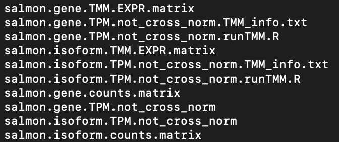

Step 2: Transcript Abundance Quantification
================

-   [Overview](#overview)
-   [Salmon](#salmon)
-   [Setting up](#setting-up)
    -   [Get organized](#get-organized)
    -   [Prepare your environment](#prepare-your-environment)
    -   [Get together the files you
        need](#get-together-the-files-you-need)
        -   [Prepare the reference
            transcriptome](#prepare-the-reference-transcriptome)
        -   [Get your supporting files](#get-your-supporting-files)
-   [Transcript abundance
    quantification](#transcript-abundance-quantification)
    -   [Outputs](#outputs)
        -   [The transcriptome index](#the-transcriptome-index)
        -   [Quantification files](#quantification-files)
-   [Preparing for next steps](#preparing-for-next-steps)
    -   [List quantification files](#list-quantification-files)
    -   [Generate counts matrices](#generate-counts-matrices)
-   [Next steps](#next-steps)

## Overview

Now that you have [quality trimmed](Step_1_QualityTrimming.md) read
files, it’s time to quantify the transcripts in each sample. To do this,
you will be using a software called `salmon`, supported by the `Trinity`
package, to align reads to a reference transcriptome and count them.
These counts will then be used for downstream [quality
checks](Step_3_ReplicateQC.md) and [differential expression
analysis](Step_4_DifferentialExpression.md).

## Salmon

Salmon is a transcript quantification tool suited for bulk RNA-Seq data.
It has two modes: *mapping-based* and *alignment-based*. We will be
using **mapping-based** mode. In this mode, salmon creates an *index* of
the reference transcriptome, then quantifies reads using this index. The
indexing portion of salmon is what allows it to work very quickly and
with minimal computational resources, without sacrificing accuracy or
sensitivity.

`salmon` is pre-installed on Discovery, but we will be using the version
of `salmon` supported by `Trinity`. This is *not* the most recent
version of `salmon`, but it has all the capability we need, is simple to
use, and the outputs are nicely organized for downstream work. `Trinity`
also comes pre-installed on Discovery, but we will set up a `Trinity`
environment containing `salmon` using
[Anaconda](../Intros_to_Coding/Anaconda.md#navigating-environments).

## Setting up

#### Get organized

If you followed [the organization outlined
earlier](GettingStarted.md#organize-your-files), then within your
project directory you should have your `raw_data`, `logs`, and `results`
directories or whatever your chosen equivalents are; the `results`
directory should contain the `paired` and `unpaired` outputs of [quality
trimming](Step_1_QualityTrimming.md). The `paired` files are what we are
going to use.

#### Prepare your environment

First, move to a compute node if you aren’t on one already:

``` bash
$ srun --pty /bin/bash
```

Then, load `anaconda`:

``` bash
# Note: this is not the most recent version of anaconda
$ module load anaconda3/3.7
```

Create your environment:

``` bash
# You can name the environment whatever you want,
# but keep it simple and descriptive.
$ conda create -n trinity-env
```

Activate this environment:

``` bash
$ source activate trinity-env
```

Finally, install `Trinity` into this environment. If you do not have
`bioconda` in your list of installation channels, [read the intro to
Anaconda](../Intros_to_Coding/Anaconda.md#note-channels) to learn how to
add it.

``` bash
$ conda install -c bioconda trinity=2.8.5
```

Because `salmon` is a dependency of `Trinity`, it should automatically
be installed with it.

#### Get together the files you need

To run transcript quantification using `salmon` supported by `Trinity`,
you only need three things:

1.  Your paired quality-trimmed read files [output by
    `trimmomatic`](Step_1_QualityTrimming.md#quality-trim-with-trimmomatic).
2.  A reference transcriptome.
3.  A text file containing the sample names and their corresponding read
    files.
4.  **Optional**: a gene-transcript map. Because each gene can have
    multiple transcripts, this file tells `salmon` which transcript
    matches which gene. I say this is optional, but considering you’re
    interested in gene-level differential expression…it’s not.

##### Prepare the reference transcriptome

Your quality-trimmed reads you should already have. You can [retrieve
the most recent axolotl transcriptome assembly
here](https://www.axolotl-omics.org/assemblies). As of right now, V47 is
the most recent version, so all steps and supporting files will be based
on this version. Click AmexT_v47 from this list, then click DNA to
download the zipped `.fa` file. It’s only 59 MB. Then, upload it to
Discovery:

``` bash
# Make sure you're in the local folder containing the .fa.zip
# I recommend creating an additional "reference_data" directory on Discovery
# in your project directory to help stay organized.
$ scp AmexT_v47_dna.fa.zip <username>@xfer.discovery.neu.edu:/path/to/reference/data
```

Now in Discovery, you should see this `.zip` file wherever you uploaded
it. If you try to use the `unzip` command to decompress the file, you’ll
receive an error. Use this command to see why:

``` bash
$ file AmexT_v47_dna.fa.zip
```

It will tell you that this is actually a gzipped file. But if you try to
use `gunzip`, you’ll receive a different error. So first, rename the
file:

``` bash
$ mv AmexT_v47_dna.fa.zip AmexT_v47_dna.fa.gz
```

Now decompress:

``` bash
$ gunzip AmexT_v47_dna.fa.gz
```

Now you have your reference transcriptome. It should be 434 MB, which
might be surprisingly small, but `.fa` is essentially just a large plain
text file.

##### Get your supporting files

Now to prepare your supporting files. You can use `vim` to prepare your
tab-delimited sample name to read file map. An example of this file is
available in the [`supporting_files` folder](./supporting_files) of this
repository; there is an additional example [on this page of the Trinity
wiki](https://github.com/trinityrnaseq/trinityrnaseq/wiki/Trinity-Transcript-Quantification#estimating-transcript-abundance).
“Tab-delimited” means exactly that: each column is separated by a tab.

Next is the gene-transcript map. Luckily, for the V47 assembly, I’ve
already prepared this. A copy of the `V47_GxT_Map` can be found [in the
`supporting_files` folder](./supporting_files). To retrieve this file
from GitHub, first go to its page. Right-click the box that says `Raw`,
click `Download Linked File As...`, and save it to your computer. Then,
you can use `scp` as you’ve done before to transfer it to your
`reference_data` directory in Discovery.

## Transcript abundance quantification

With your environment set up and all your files together, it’s time to
do the actual quantification. Use `vim` to create a script file:

``` bash
$ vim quantification.sh
```

Then enter the following, editing where necessary:

``` bash
#!/bin/bash
#SBATCH --nodes=1
#SBATCH --time=8:00:00
#SBATCH --job-name=Quant
#SBATCH --mem=10G
#SBATCH --partition=short

# quantification.sh
# This script will prepare a transcriptome index of the v47 axolotl transcriptome assembly.
# It will then quantify reads specified in "samples.txt"

# EDIT this path to point to this script file in YOUR conda environment
/home/<username>/.conda/envs/trinity-env/opt/trinity-2.8.5/util/align_and_estimate_abundance.pl \
  --transcripts ../reference_data/AmexT_v47_dna.fa \
  --seqType fa \
  --samples_file samples.txt \
  --est_method salmon \
  --salmon_idx_type quasi \
  --prep_reference \
  --salmon_add_opts "--validateMappings --recoverOrphans --rangeFactorizationBins 4 --seqBias" \
  --gene_trans_map ../reference_data/V47_GxT_Map.txt
```

A copy of this script is also available [in the `scripts`
directory](./scripts/quantification.sh). Here are what each of these
arguments mean:

-   The first line is pointing to the `align_and_estimate_abundance.pl`
    *source code* that does the hard work which makes your job easier.
    Writing in `perl` would be a **lot** less fun than writing in `bash`
    like you are here :)
-   The `--transcripts` flag is pointing to the transcriptome assembly.
    `..` indicates one directory “up” (your project directory), then
    back “down” to the directory containing the transcriptome, here
    `reference_data`.
-   `--seqType` is telling this script that the reference transcriptome
    is a `.fa` or `.fasta` file.
-   `--samples_file` is indicating exactly that, the `samples.txt` file
    detailing the samples, replicates, and their corresponding read
    files.
-   `--est_method` is telling the quantification to use `salmon`. There
    are other options supported by `trinity`, but we will ignore them.
-   `--salmon_idx_type` with `quasi` means it will use *quasi-mapping*
    against a transcriptome index, a.k.a. the *mapping-based mode*
    discussed above.
-   `--prep_reference` means that we don’t have an existing
    transcriptome index, and that it needs to be prepared before
    quantification.
-   `--salmon_add_opts` is allowing you to add arguments specific to
    `salmon`:
    -   `--validateMappings` is a default in newer versions of `salmon`
        than what you are using here. This will greatly improve
        accuracy, especially alongside the next few parameters. Do
        **not** delete this flag.
    -   `--recoverOrphans` will “rescue” orphaned reads. This should
        only be used in combination with `--validateMappings` and can
        improve sensitivity.
    -   `--rangeFactorizationBins` can improve accuracy when also using
        `--validateMappings`. The `salmon` documentation recommends `4`
        as a good parameter here. There is [a paper discussing this
        algorithm](https://academic.oup.com/bioinformatics/article/33/14/i142/3953977)
        if you’re curious.
    -   `--seqBias` enables learning and correction of sequence-specific
        biases that can arise from library preparation.
-   Finally, `--gene_trans_map` is pointing to the gene-transcript ID
    map that allows you to do gene level quantification.

For reference, preparing a transcriptome index and running `salmon` on
12 read files ranging from roughly 600-800 MB took about 3.5 hours and
6.5 GB of memory. If you think you will need more time or memory, adjust
the heading `SBATCH` parameters accordingly.

### Outputs

#### The transcriptome index

In your `reference_data` directory, or wherever you have the V47
transcriptome assembly stored, you will see a new directory called
`AmexT_v47_dna.fa.salmon_quasi.idx`. This is the transcriptome index
built by `salmon`. You’ll see a few `.log`, `.json`, and `.bin` files in
there, as well as a `.tsv`. You can view the `.log`, `.json`, and `.tsv`
files, but the `.bin` files are encrypted. There’s nothing else to be
done with this index, but it’s okay to hold on to for now.

#### Quantification files

In the directory containing your read files, you will now see
directories named according to the replicate names you provided in
`samples.txt`. Each of these directories contain sub-directories with
several miscellaneous log files and additional information. What you are
interested in, however, are the `quant.sf` and `quant.sf.genes` files.
These are the transcript- and gene-level quantification files,
respectively.

## Preparing for next steps

Before you move on to [replicate quality
control](Step_3_ReplicateQC.md), you need to combine all of the
`quant.sf` files into one matrix. The `trinity` package has a convenient
script for doing exactly this.

#### List quantification files

Before creating the counts matrices, you need to create a text list of
the quantification files. This can be done quickly and easily directly
in the command line.

``` bash
# Edit the sample names to match the conditions named in your samples.txt file. 
# These should be the names of the counts directories output by salmon.
$ find condition-A-* condition-B-* condition-C-* -name 'quant.sf' | tee quant_files.list
```

If you look at your file using `$ more quant_files.list` you should see
a list of the sample directories with their `quant.sf` files.

#### Generate counts matrices

Now you can create your counts matrices to use downstream. Make sure you
have the same `trinity` environment activated as you did above. You will
also need to load `R` into your environment:

``` bash
$ module load R
```

Then, create a `getMatrices.sh` file using `vim`:

``` bash
$ vim getMatrices.sh
```

Enter the following (a copy is also available [in the `scripts`
directory](./scripts/getMatrices.sh)):

``` bash
#!/bin/bash
#SBATCH --partition=express

# getMatrices.sh
# This script generates combined counts matrices and TMM-normalized counts matrices on quant_files.list files.

/path/to/your/trinity-env/opt/trinity-2.8.5/util/abundance_estimates_to_matrix.pl \
  --est_method salmon \
  --quant_files quant_files.list \
  --name_sample_by_basedir \
  --gene_trans_map ../reference_data/V47_GxT_Map.txt
```

This is a quick and simple script, so if you’re comfortable you could
also run it in your command line directly rather than writing a script
file. Give the script execution permission with
`$ chmod u+x getMatrices.sh`, then run it with
`$ sbatch getMatrices.sh`.

You should see these outputs:

<!-- -->

The `.txt`, `.R`, and `.not_cross_norm` files aren’t necessary from here
out. But the `.counts.matrix` files for both `isoform` and `gene`, as
well as their corresponding `.TMM.EXPR.matrix` files, will be. The
`.TMM.EXPR.matrix` files are TMM cross-normalized.

## Next steps

Before [differential expression
analysis](Step_4_DifferentialExpression.md), we will be running another
[quality control](Step_3_ReplicateQC.md) to make sure everything looks
good to go.
