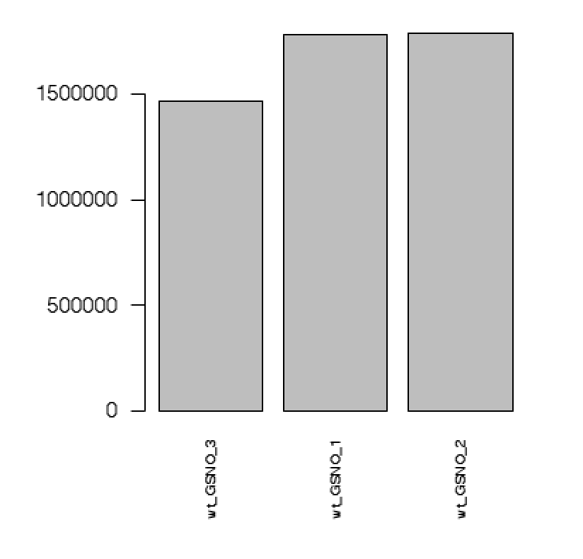
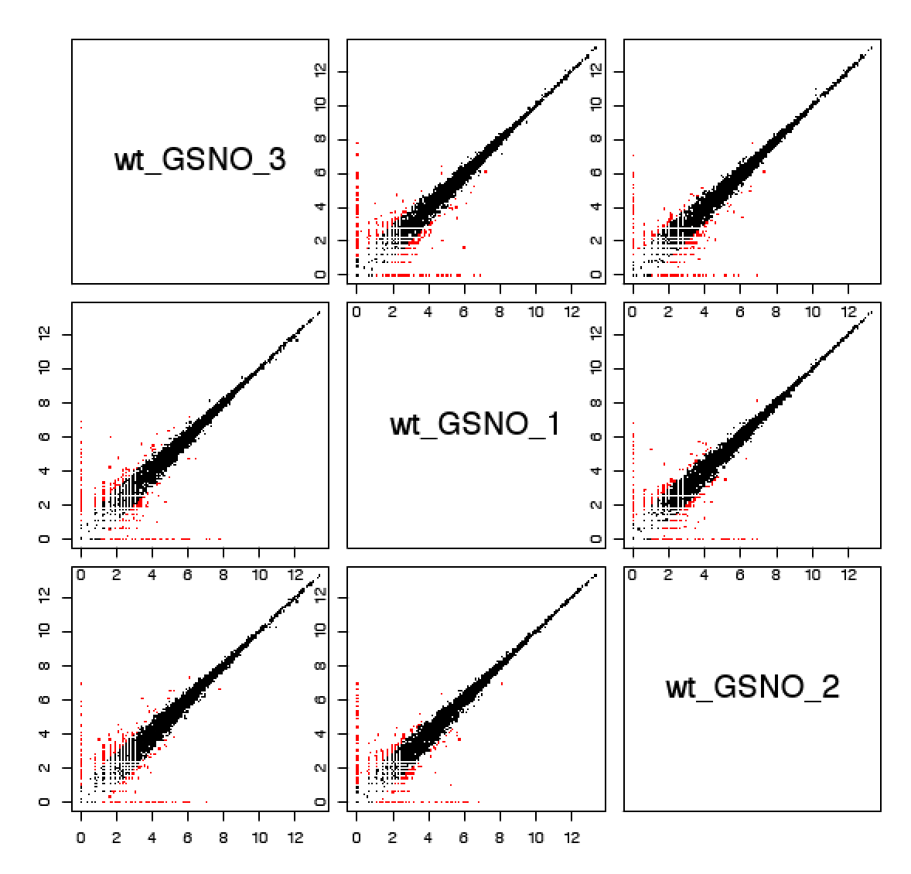
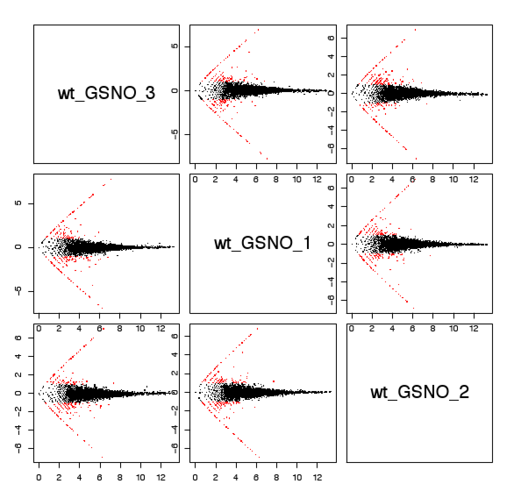
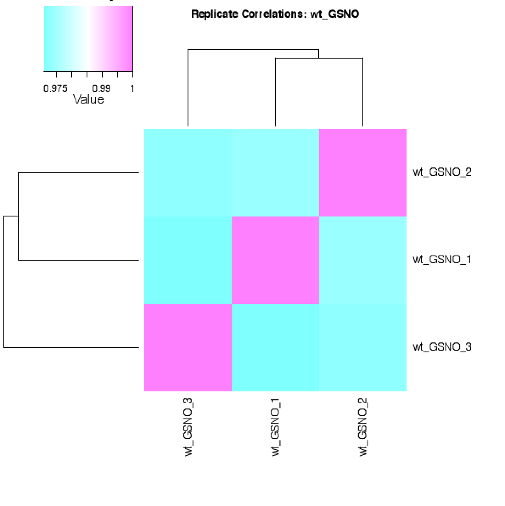
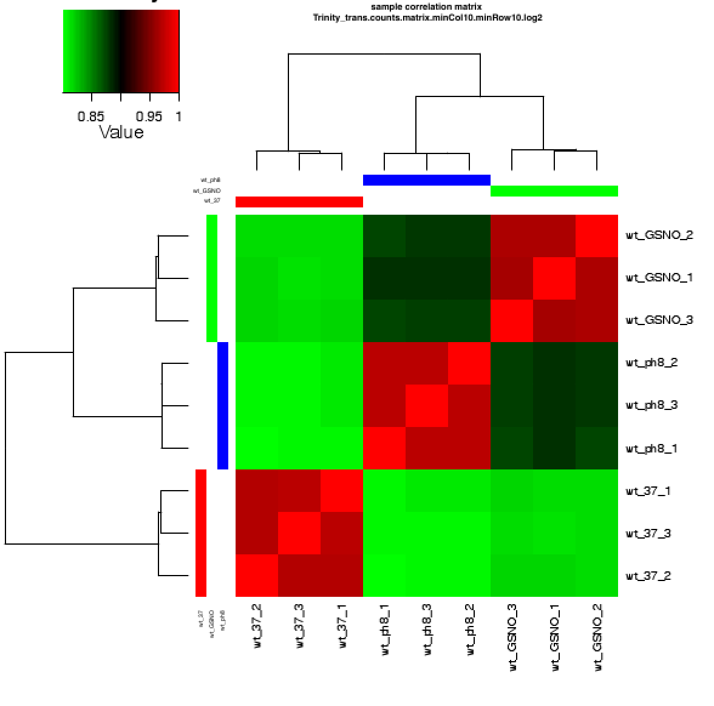
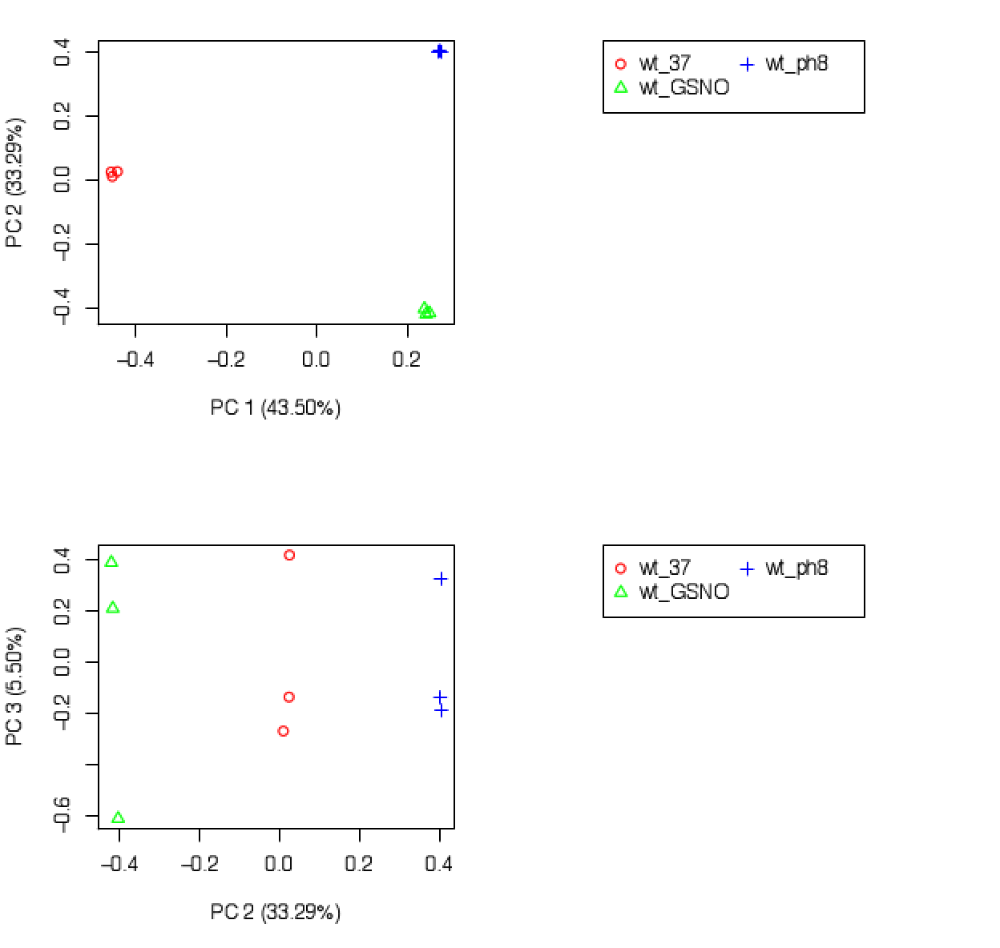

Step 3: Quality Check Replicates
================

-   [Overview](#overview)
    -   [Set up](#set-up)
        -   [Create samples file](#create-samples-file)
    -   [Run QC script](#run-qc-script)
    -   [Export and view results](#export-and-view-results)
        -   [Comparing between sample
            replicates](#comparing-between-sample-replicates)
        -   [Comparing across samples](#comparing-across-samples)
            -   [Sample correlation matrix](#sample-correlation-matrix)
            -   [Principal component
                analysis](#principal-component-analysis)
    -   [Removing “bad” samples](#removing-bad-samples)
-   [Next steps](#next-steps)

## Overview

A lot of things can go wrong in sequencing that might not necessarily be
reflected [in your `fastqc`](./Step_1_QualityTrimming.md). The most
common of these are known as *batch effects*. Batch effects occur when
sequencing is done in multiple runs, when samples are prepared by
different people or at different times, and so on - thereby creating
batches. It’s important to check for the possibility of batch effects so
that you can remove “bad” samples before they confound your analyses.
Luckily it’s simple and quick to do these checks.

### Set up

The following QC is again supported by the `Trinity` package. First,
change to a compute node if you aren’t already on one:

``` bash
$ srun --pty /bin/bash
```

Next, load `anaconda`:

``` bash
$ module load anaconda3/3.7
```

Activate your environment:

``` bash
$ source activate trinity-env
```

You will also need to load `R`:

``` bash
$ module load R/4.0.2
```

#### Create samples file

You should already have a `samples.txt` file from your [transcript
abundance quantification](./Step_2_AbundanceQuant.md). The quality check
needs a slightly stripped version of this, which is very easy to create
in your command line:

``` bash
$ less -S samples.txt | awk '{print $1"\t"$2}' >> samples_ptr.txt
```

Here you are “reading” your `samples.txt` file with `less`, piping it to
`awk`, and printing the first two columns to a new `samples_ptr.txt`.

### Run QC script

The `PtR` script is in the `Analysis/DifferentialExpression` directory
of `Trinity` in your `conda` environment. You will invoke this script
three times to generate the three reports we want. Create your
`quality_check.sh` script with `vim`:

``` bash
$ vim quality_check.sh
```

Then enter the following (there is also a copy available [in the scripts
directory](./scripts)):

``` bash
#!/bin/bash
#SBATCH --partition=express

# quality_check.sh 
# This script uses Trinity's PtR script to generate sample replicate and cross-sample QC plots.

# This generates the sample replicate comparisons for each condition
# Edit the username
/home/<username>/.conda/envs/trinity-env/opt/trinity-2.8.5/Analysis/DifferentialExpression/PtR \
  --matrix salmon.isoform.counts.matrix \
  --samples samples_ptr.txt \
  --log2 --CPM \
  --min_rowSums 10 \
  --compare_replicates
  
# This generates the sample correlation heatmap
# Edit the username
/home/<username>/.conda/envs/trinity-env/opt/trinity-2.8.5/Analysis/DifferentialExpression/PtR \
  --matrix salmon.isoform.counts.matrix \
  --samples samples_ptr.txt \
  --log2 --CPM \
  --min_rowSums 10 \
  --sample_cor_matrix
  
# This generates a principal component analysis for the top 3 principal components
# Edit the username
/home/<username>/.conda/envs/trinity-env/opt/trinity-2.8.5/Analysis/DifferentialExpression/PtR \
  --matrix salamon.isoform.counts.matrix \
  --samples samples_ptr.txt \
  --log2 --CPM \
  --min_rowSums 10 \
  --center_rows \
  --prin_comp 3
```

Give your script execution permission:

``` bash
$ chmod u+x quality_check.sh
```

Then execute with `sbatch`:

``` bash
$ sbatch quality_check.sh
```

This script is really quick, and depending on the amount of samples you
have, it will only take a minute or two. If you’re comfortable with the
command line, these commands could also be run directly through the CL
instead of in a script.

You can also re-run your quality check using the
`salmon.gene.counts.matrix` file.

### Export and view results

There will be quite a few miscellaneous files output by `PtR`, which you
can effectively ignore (or move to your `reference_data` directory).
What you are interested in are the `.pdf` files. You can’t view these
directly on Discovery, so you need to transfer them to your local
computer.

In a **local** command line window, navigate to where you want to put
your files, then enter:

``` bash
$ scp <username>@xfer.discovery.neu.edu:/path/to/PtR/results/*.pdf .
```

You can then open these `.pdf` files on your local computer to view.

#### Comparing between sample replicates

There will be several `.pdf` files corresponding to each of your sample
names, such as `Control.rep_compare.pdf`. Within each of these reports
you will see:

**A bar graph of the number of mapped fragments per sample**:
<!-- -->

Check to see that there are no samples with unusually high or low
mapping.

**Comparisons of replicates’ log2(CPM) values, with points \>2 in red**:
<!-- -->

This should be a mostly linear correlation as shown above. Red points
aren’t necessarily bad, unless they are “unbalanced” in relation to the
relative number of black points.

**MA plots of average log2(CPM) (x-axis) versus log2(fold change)
(y-axis)**: <!-- -->

As above, there should be a thick central line, with red points
scattered around it. Similarly to the previous plot, red points aren’t a
bad sign unless there are notably many more compared to the black
points.

Finally, **a sample correlation heatmap**:
<!-- -->

Pay attention to the values in the top left scale. This heatmap tells
you how closely related replicates are to one another, also indicated by
the left-most phylogeny. If there is a high disparity between any of the
replicates, or a single replicate that greatly stands out, this warrants
further investigation into the previous and following comparisons.

#### Comparing across samples

##### Sample correlation matrix

The sample correlation matrix will look something like this (potentially
with different colors): <!-- -->

This will show how each replicate of each sample relates to one another,
both in color scale and the left-most phylogeny. You should see
clustering between sample replicates as above. If the previous plots
showed disparity in one or more replicates, it may be further reflected
here. If [your later differential
expression](Step_4_DifferentialExpression.md) shows unusual or limited
results, this might provide some explanation.

##### Principal component analysis

Principal component analysis is a complicated mathematical breakdown of
each sample into its “principal components”. The axes in the plots below
basically represent the components which account for the most variance
in the data, and the percentage indicates how much. You’ve plotted the
top 3 components here. <!-- -->

In the PC 1 vs. PC 2 plot, you should see some amount of clustering
among sample replicates (although not necessarily as clear-cut as the
above example), and “outliers” will make themselves evident. In
combination with the other QC plots, this could indicate if a replicate
might be confounding. In the PC 2 vs. PC 3 plot, you should again see
some amount of clustering, although not necessarily as strongly as above
and not as strongly as in the PC 1 vs. PC 2 plot. This is because PC 3
should only account for a small amount of the variance within the data,
and therefore plotting this component won’t as distinctly separate
groups.

### Removing “bad” samples

After much consideration, if you choose to remove one or more outliers,
it is quick and easy to do so. All you need to do is open your
`samples_ptr.txt` (which you will use from here out, so you can rename
it and delete the original `samples.txt` if you’d like) with `vim`. Then
simply delete the lines containing the replicates you want to exclude.
The differential expression analysis takes the `samples.txt` as input to
select the columns matching those names, and will ignore the columns
that do not match any of the names in that list. As a result, removing
the replicates from that list effectively removes them from any
downstream work.

## Next steps

With your corrected matrices and samples files, you are finally ready
for [differential expression
analysis](Step_4_DifferentialExpression.md)!
