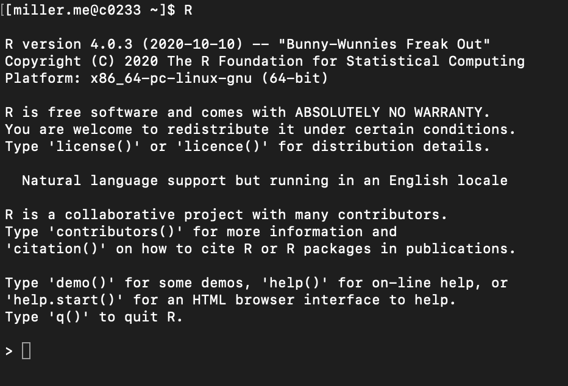

Step 4: Differential Expression Analysis
================

-   [Overview](#overview)
-   [Set up](#set-up)
    -   [Prepare R environment](#prepare-r-environment)
    -   [Supporting files](#supporting-files)
-   [Run differential expression
    analysis](#run-differential-expression-analysis)
    -   [Outputs](#outputs)
        -   [Note: log2(FC) reporting](#note-log2fc-reporting)
    -   [Name the genes](#name-the-genes)
-   [DESeq2 variations](#deseq2-variations)
-   [Next steps](#next-steps)

## Overview

With your gene-level quantification (and transcript level, if
differential isoform expression is something you’re interested in), it’s
finally time for the differential expression analysis. The end result is
a essentially a list of genes ordered by ascending adjusted p-value. You
can then use this list for gene ontology analysis, selecting targets for
knockout or over-expression experiments, and FISH to visualize gene
expression *in situ*. You will be using
[DESeq2](https://www.ncbi.nlm.nih.gov/pmc/articles/PMC4302049/)
supported by `trinity` to run this analysis.

## Set up

First, switch to a compute node if you aren’t already on one:

``` bash
$ srun --pty /bin/bash
```

Then, load `anaconda`:

``` bash
$ module load anaconda3/3.7
```

And activate your `trinity-env`:

``` bash
$ source activate trinity-env
```

### Prepare R environment

You will need `R` loaded for this step:

``` bash
$ module load R/4.0.3
```

There are several `R` packages that `trinity` needs in order to execute
the differential expression analysis script. In Discovery, with `R`
loaded, open it through the command line:

``` bash
$ R
```

You will now be in an `R` environment like this:
<!-- -->

Enter each line of the following script one at a time, hitting `enter`
after each one:

``` r
if (!requireNamespace("BiocManager", quietly = TRUE))
  install.packages("BiocManager")
BiocManager::install(c("edgeR", "limma", "DESeq2", "ctc", "Biobase", "gplots", "ape", "argparse"))
```

These packages will take several minutes to install. If you run into
trouble with any of them, you may need to `module unload R` and instead
load `R/4.0.2`.

You can exit R with the following:

``` r
q()
```

It will ask if you want to save your data. You can press `n`.

### Supporting files

For the differential expression analysis, you only *need* your
transcript- or gene-level **raw** counts matrix (not TMM normalized).
There are two other recommended files you can use to support the
analysis:

1.  Your tab-delimited samples-to-replicates file which you [used with
    QC](Step_3_ReplicateQC.md#create-samples-file).
2.  A tab-delimited contrasts file indicating the comparisons to be run.
    You can alternatively provide a *reference sample* to which all
    other samples will be compared. Otherwise, all pairwise comparisons
    will be analyzed.

## Run differential expression analysis

First, create your script:

``` bash
$ vim differential_expression.sh
```

With your `trinity-env` active, and with `R` loaded, you can run the
script below (a copy is also available [in the scripts
directory](./scripts)):

``` bash
#!/bin/bash
#SBATCH --partition=express
#SBATCH --time=00:20:00

# Edit path
/home/<username>/.conda/envs/trinity-env/opt/trinity-2.8.5/Analysis/DifferentialExpression/run_DE_analysis.pl \
  --matrix salmon.gene.counts.matrix \
  --method DESeq2 \
  --samples_file samples_ptr.txt
```

Here we’re using [DESeq2](https://pubmed.ncbi.nlm.nih.gov/25516281/) for
this analysis. This could be run through the command line, but
submitting a job script saves the `slurm` log file so you can diagnose
bugs.

Additional parameters for your script:

1.  `--min_reps_min_cpm` allows you to set the minimum count of
    replicates which much have a minimum CPM (counts per million) value
    for a transcript / gene.
2.  `--output` lets you name the output directory. Otherwise it will be
    a generic `DESeq.####.dir`.
3.  `--reference_sample` lets you name a sample to which all others
    should be compared. I.e. `Homeostatic` or `14dpa` or `Innervated`.
    This must match a sample name provided in `samples_ptr.txt`.
4.  `--contrasts` indicates the tab-delimited file specifying which
    pairwise comparisons to run. Without this and without the
    `--reference_sample` flag, all pairwise comparisons will be
    analyzed.

Give your script execution permission:

``` bash
$ chmod u+x differential_expression.sh
```

And then run:

``` bash
$ sbatch differential_expression.sh
```

Which you can monitor with `squeue -u <username>`.

#### Outputs

For each of the pairwise comparisons analyzed, you will see a number of
output files. They all will begin with your matrix name (such as
`salmon.gene.counts.matrix`), include the pair compared (such as
`innervated_vs_denervated`), the method used (`DESeq2`), and an
extension indicating what they are:

1.  `.count_matrix` is a subset of the input count matrix specific to
    the two groups being compared.
2.  `.samples` is a subset of the samples file specific to the two
    groups being compared.
3.  `.Rscript` is a script file in the `R` language running the steps of
    DESeq2.
4.  `.MA_n_Volcano.pdf` shows MA and volcano plots for the top
    differentially expressed genes, with notable genes named.
5.  `.DE_results` are, as expected, the results of the differential
    expression analysis. Use `less <filename>` to view the file, and
    press `q` to exit this view.

To view the MA and volcano plots, and view the DE results in Excel, you
need to export them to your local computer. Navigate to one directory
*above* the DESeq2 output directory, then use `pwd` to get the file
path. On your **local** computer, navigate to where you want to put the
results, then use:

``` bash
$ scp -r <username>@xfer.discovery.neu.edu:/path/to/data/DESeq2dir .
```

##### Note: log2(FC) reporting

Depending on how your samples are named, you might notice an error in
the DE results files, namely that the reported respective average counts
for `sampleA` and `sampleB` are opposite to what you’d expect given the
reported `log2FC`. For example, if your conditions are innervated
vs. denervated, with innervated as `sampleA` and denervated as `sampleB`
and means of 200 and 400, respectively, you would *expect* a log2FC of 1
indicating an increase in expression from innervated to denervated.
However, what’s reported is a -1.

This is a quirk of DESeq2, in which the alphabetically “last” sample
name is automatically set as the reference. Sometimes this can be
overcome with the `--reference_sample` or `--contrasts` flag, but not
always. If you run into this error, you can edit the `.Rscript` files
for the erroneous comparisons on Discovery and re-run them, without
re-running the whole analysis script. Open the file:

``` bash
$ vim <filename>.Rscript
```

Within the `vim` interface, use `:set number` to show line numbers. The
first line you need to edit, which should be line 25, is this:

``` r
contrast=c("conditions","condition_1","condition_2")
```

Swap the order of the conditions (i.e. 1 and 2) in this list, making
`condition_1` your chosen reference (e.g., innervated) and `condition_2`
the other (denervated).

Next, check lines 29 through 32:

``` r
baseMeanA <- rowMeans(counts(dds, normalized=TRUE)[,colData(dds)$conditions == "condition_1"])
baseMeanB <- rowMeans(counts(dds, normalized=TRUE)[,colData(dds)$conditions == "condition_2"])
res = cbind(baseMeanA, baseMeanB, as.data.frame(res))
res = cbind(sampleA="condition_1", sampleB="condition_2", as.data.frame(res))
```

This section might be fine! But if the orders are reversed, change
anything with “condition_1” to “condition_2”, and anything with
“condition_2” to “condition_1”. To rerun this script, first make sure
you are on a compute node with `anaconda` and `R` loaded. Activate your
`trinity-env`. Then you can run the script using:

``` bash
$ Rscript <filename>.Rscript
```

This will take several minutes as the differential expression analysis
is rerun. You will need to repeat this for all erroneous samples
(because this is due to alphabetical sorting, it’s possible not all are
incorrect). Check the output directory, and you should see the same
kinds of results files as earlier. Check that the `.DE_results` files
are now correct. `scp` all corrected results to your local computer [as
you did above](#outputs).

#### Name the genes

If you’ve followed along this far, you now have a list or multiple lists
of differentially expressed genes between conditions. The problem is,
all of the genes have “AMEX” IDs rather than actual gene names. Rather
than sift through the genome annotation file ID-by-ID, you can easily
use a V-lookup in Excel. You will need to download [the
`V47_GeneID_GeneName.txt` file in the supporting files
directory](supporting_files/V47_GeneID_GeneName.txt).

1.  Open your selected `.DE_results` file in Excel. Open the
    `V47_GeneID_GeneName.txt` in Excel also.
2.  Create a new column to the right of the AMEX ID column. You will
    also need to move around the column headers to match their new
    locations.
3.  You will use the VLOOKUP function in Excel to match each AMEX ID to
    a gene name in the given file. The format of VLOOKUP is this:
    -   =VLOOKUP(cell#, reference_array, column_in_ref_array,
        TRUE/FALSE)
        -   Cell# is the cell you are looking up.
        -   reference_array is pointing to the list you will search to
            match a new value to the input cell#.
        -   column_in_ref_array is telling Excel what value from the
            reference_array to print.
        -   TRUE tells Excel that a “close enough” match suffices. You
            want FALSE, to find an exact match.
4.  Type `=VLOOKUP(` into the cell to the right of the first AMEX ID.
5.  Select the first AMEX ID to fill in the cell#, probably A2. Then
    type a comma in your formula bar.
6.  Switch to the spreadsheet of `V47_GeneID_GeneName` and highlight
    both columns. Then type another comma in the formula bar.
7.  Switch back to the `.DE_results` spreadsheet. Type `2`, a comma,
    then `FALSE` and the closing bracket `)`.
8.  Hit `enter`. You should see a value populate the cell. It might be a
    gene name, but a lot of axolotl genes also have no annotation - so
    it might just be the AMEX ID repeated.
9.  Double-click the square in the bottom right corner of the
    newly-populated cell. This will automatically fill in the gene name
    column for the rest of the results.

## DESeq2 variations

If you are comfortable with the `R` language and have an `R` environment
(preferably RStudio) on your computer, there is [a comprehensive DESeq2
vignette](https://www.bioconductor.org/packages/devel/bioc/vignettes/DESeq2/inst/doc/DESeq2.html)
that you can follow along. The vignette presents several variants to the
DESeq2 workflow, notably the likelihood ratio test (LRT). Normally
DESeq2 uses a *Wald test* for its hypothesis testing, thereby generating
the pairwise outputs seen above. The LRT is appropriate in cases where
you have a time series or drug titration, such that you might want to
see what kinds of gene expression patterns there are over the course of
time or drug concentration. There is also a lot more you can explore
with DESeq2 in RStudio, but as this requires more advanced and in-depth
programming fluency I will not be covering this.

## Next steps

A list of differentially expressed genes, while useful, is not a
complete story. Now we are interested in what kinds of functions these
genes tend to have. This is where [gene ontology
analysis](Step_5_GO_analysis.md) comes in.
