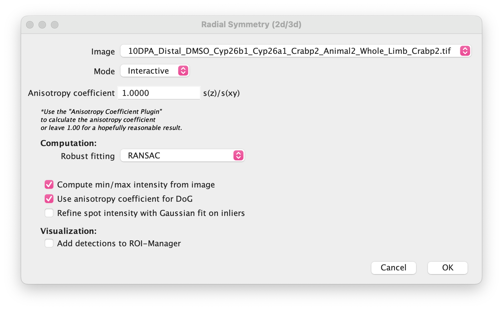
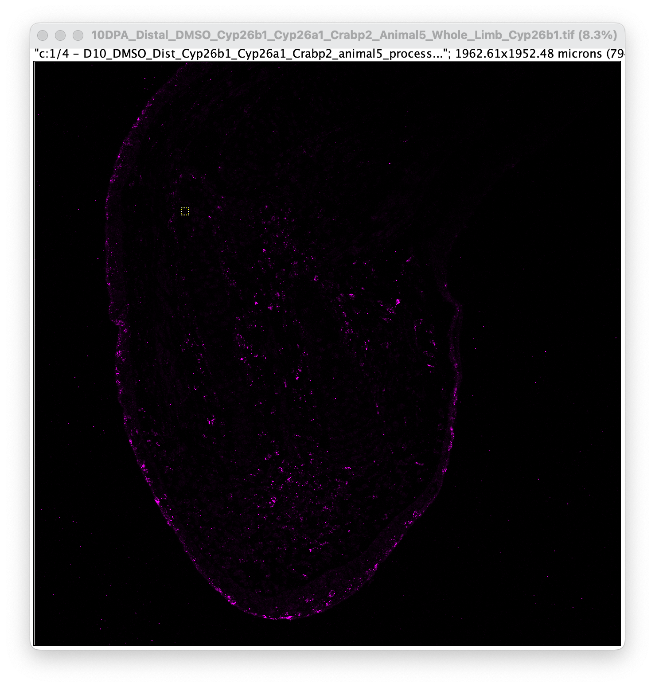
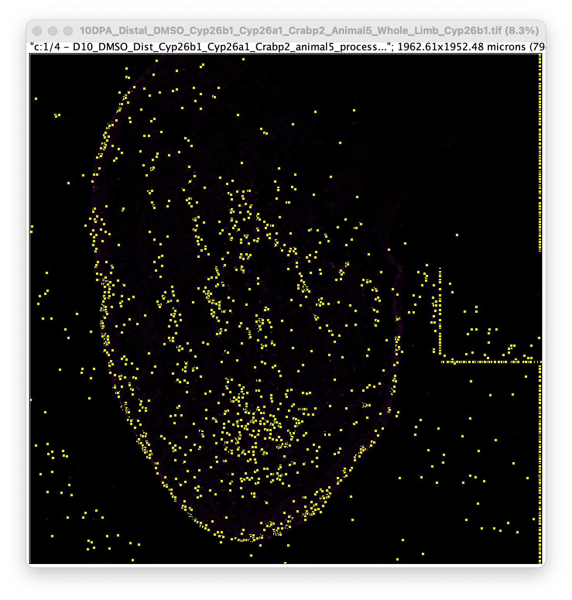
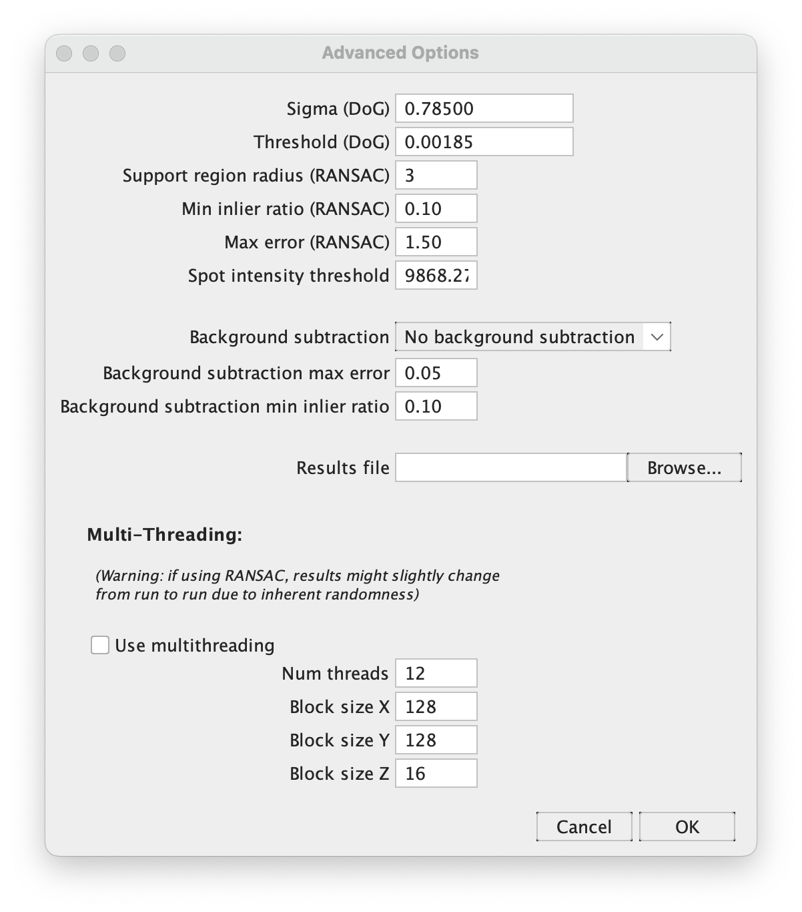
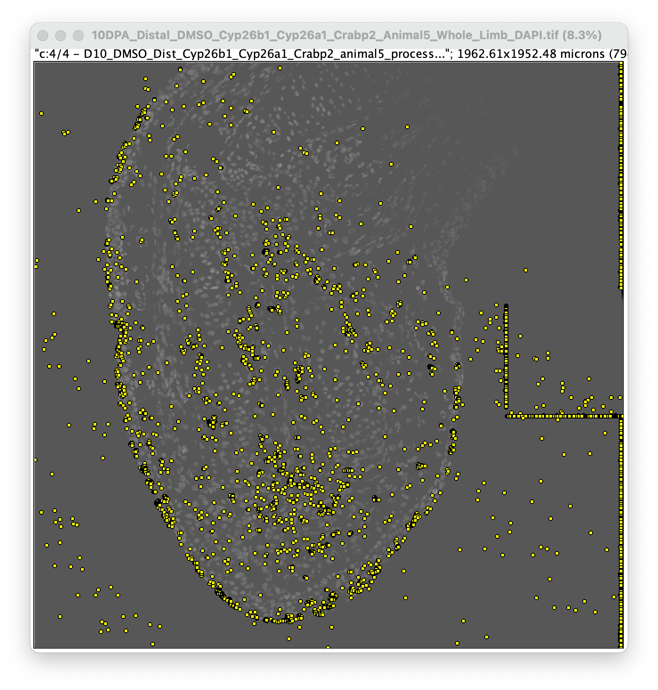
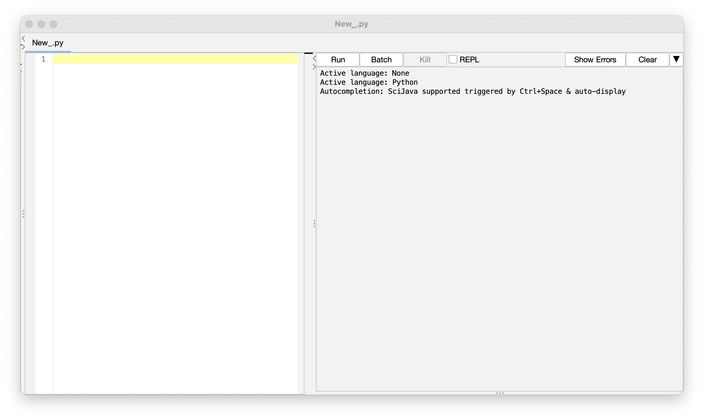

V3 HCR-FISH dot quantification with RS-FISH
================

-   [Overview](#overview)
    -   [Image pre-processing](#image-pre-processing)
    -   [Moving images from OneDrive to the Discovery cluster with
        `rclone`](#moving-images-from-onedrive-to-the-discovery-cluster-with-rclone)
        -   [Configuring `rclone`](#configuring-rclone)
        -   [Transferring files](#transferring-files)
            -   [Note on filters](#note-on-filters)
    -   [Cellpose for ROI outlines](#cellpose-for-roi-outlines)
        -   [Locally](#locally)
            -   [Installation on Windows](#installation-on-windows)
                -   [Note: Mac (as of October
                    2022)](#note-mac-as-of-october-2022)
            -   [The GUI](#the-gui)
            -   [Jupyter Notebook](#jupyter-notebook)
        -   [On Discovery](#on-discovery)
            -   [In the command line](#in-the-command-line)
            -   [In a script](#in-a-script)
    -   [RS-FISH FIJI plugin to find
        maxima](#rs-fish-fiji-plugin-to-find-maxima)
        -   [Setting parameters in interactive
            mode](#setting-parameters-in-interactive-mode)
        -   [Dot detection in advanced
            mode](#dot-detection-in-advanced-mode)
        -   [Creating maxima image](#creating-maxima-image)
    -   [ROI converter](#roi-converter)
    -   [Further steps](#further-steps)

# Overview

This pipeline is designed to provide quantitative gene expression data
to the qualitative, visual data generated by HCR-FISH. Broadly, you
segment cells with Cellpose to get ROIs. Then, you use the FIJI plugin
“RS-FISH” to identify dots and then create an image of the resulting
maxima. Using the Cellpose ROI converter macro combined with the RS-FISH
maxima image gives you measurements of Raw Integrated Density in each
ROI. The “RawIntDen” is the number of dots in that ROI multiplied by 255
(as a result of pixel values in the maxima image). You can then
concatenate all of these measurements and chart expression levels over
time, treatment, etc.

This pipeline assumes familiarity with the command line, Anaconda
package manager, Jupyter Notebook, the Discovery cluster, and Vim text
editor. If you need practice with any of these topics, please [see the
relevant introductions in this repository](../../Intros_to_Coding/).

## Image pre-processing

Hopefully while imaging you’ve already processed the direct images with
AiryScan processing, stitching, and max intensity projection. Then you
will need to divide your processed whole-limb, four-channel image to
separate out tissue of interest (blastema, epithelium, and mesenchyme,
for example) as well as split the channels to run RS-FISH on. [The
instructions for doing this are here](./Tissue_Isolation.md).

## Moving images from OneDrive to the Discovery cluster with `rclone`

If you are later [working with Cellpose](#cellpose-for-roi-outlines) and
[RS-FISH](#rs-fish-fiji-macro-to-find-maxima) locally, you can skip
these steps and just download images straight from Omero or OneDrive to
your local computer.

### Configuring `rclone`

From the rclone website: “[`rclone`](https://rclone.org) is a
command-line program to manage files on cloud storage”. It has a fairly
simple setup that allows you to transfer files to and from cloud storage
servers like Microsoft OneDrive, and is available on Discovery. The
website is where you can find all of the documentation and help on the
following steps [for configuring with
OneDrive](https://rclone.org/onedrive/).

In order to configure `rclone` on Discovery, you will also need to have
it installed on your local machine. [Follow the instructions
here](https://rclone.org/install/) to install it if you do not already
have it. It is recommended that you use the same `rclone` version on
both your local and remote servers, so try to get as close as possible.

First, connect to Discovery:

``` bash
$ ssh <username>@login.discovery.neu.edu
```

Then move to a compute node:

``` bash
$ srun --pty /bin/bash
```

And finally, load the `rclone` module:

``` bash
$ module load rclone
```

You can check that `rclone` was loaded properly with `which rclone`.

Now make sure you are in your `home` directory:

``` bash
$ cd ~
```

Now, [follow the instructions here](https://rclone.org/onedrive/)
starting with `rclone config` to set up the link between Discovery and
OneDrive.

### Transferring files

Once you’ve configured `rclone`, you can move images to Discovery. You
can do this easily in a script:

``` bash
$ vim rclone.sh
```

Once in `vim`, hit `i` to enter `Insert` mode, and enter the following
(a copy is also available [in the `scripts`
directory](./scripts/rclone.sh)):

``` bash
#!/bin/bash
#SBATCH --partition=short
#SBATCH --job-name=rclone

# You can delete this line but I like to leave it in so you 
# don't have to load rclone yourself every time
module load rclone

# Edit your remote directory name and image location path here
rclone copy --progress --filter-from filter.txt remote:OneDrive-Directory-Name /path/to/final/image/location
```

`rclone copy` is doing exactly that - copying files from your OneDrive
to Discovery. `--progress` tells `rclone` to keep a log of the
progression, which will be output in a `slurm` log for you to monitor.
There is [more info on `--filter-from` below](#note-on-filters).
`remote:` designates which directory you’re pulling your files from.
`rclone` will pull designated files from **all** subdirectories of this
directory, so you can make this path more specific (still starting from
the top directory) if you don’t want everything. The final path is
telling `rclone` where to dump all the images from OneDrive. This will
likely be a project directory created by you in your `scratch` or `work`
directory. Once you have all your files from OneDrive, you can `cp` or
`mv` your `Blastema`, `Epithelium`, and `Mesenchyme` `DAPI` images to
another folder for [Cellpose segmentation](#cellpose-for-roi-outlines).

#### Note on filters

Above, I used a `--filter-from` flag along with `filter.txt`. This is to
avoid copying over excess images or other files that I don’t need, which
saves time and keeps things from being too cluttered. If you want all
images, you can delete this flag and file. Otherwise, [follow the
instructions here](https://rclone.org/filtering/) on how to create your
filter file. Here’s an example of what I use (available [in the
supporting files directory](./supporting_files/filter.txt)):

``` bash
+ *_Blastema_DAPI.tif
+ *_Mesenchyme_DAPI.tif
+ *_Epithelium_DAPI.tif
- *_Whole_Limb_DAPI.tif
+ *_Whole_Limb_*.tif
- *
```

Here, the `+` is telling `rclone` what to include, while `-` tells it
what to exclude. I’m keeping all of the `DAPI` channel images from the
isolated tissues, because that’s what gets segmented by Cellpose. The
`_Whole_Limb_DAPI` images aren’t needed for segmentation, so I exclude
them. However, for `RS-FISH` I might want the color channel images, so I
add all the others. `*` is a wildcard character matching any pattern. If
you are running `RS-FISH` locally, you can replace these two
`Whole_Limb` lines with `- *_Whole_Limb_*`, because you don’t need any
of them on Discovery.

## Cellpose for ROI outlines

[Cellpose](https://www.biorxiv.org/content/10.1101/2022.04.01.486764v1)
is a machine-learning algorithm designed for cell and nucleus
segmentation in both 2D and 3D. There is support for [a GUI](#the-gui)
as well as use [in the command line](#on-discovery) and [Jupyter
Notebook](#jupyter-notebook). It also [has pretty good
documentation](https://cellpose.readthedocs.io/en/latest/) and [a
detailed GitHub page](https://github.com/MouseLand/cellpose) that makes
it easy to navigate.

### Locally

#### Installation on Windows

Follow [the instructions here](https://github.com/MouseLand/cellpose)
for how to install Cellpose on a Windows or Linux system, including if
you want GUI support or not. It’s pretty straightforward if you’re
already familiar with Anaconda.

##### Note: Mac (as of October 2022)

There is a dependency of Cellpose that is currently too out-of-date to
be compatible with Mac software. Hopefully this will be resolved soon.
If you follow the instructions above for a Linux system, you will still
successfully install Cellpose. The issue is that Cellpose won’t be able
to utilize your computer’s GPU, and instead will resort to CPUs (which
it will tell you if you try to run it in the CL or a Notebook). GPUs
(graphics processing units) are specifically set up to parallelize tasks
and allocate resources in a way that’s great for …processing graphics,
while CPUs are really bad at this. Cellpose will run, but it could take
upwards of an hour to segment one image, and eat up enough RAM in the
process that it could crash your machine. If you have a Mac, and this
dependency issue is not yet resolved, I cannot recommend enough that you
save yourself the trouble and [instead use Discovery](#on-discovery) or
one of the workstations in ISEC.

#### The GUI

If you installed Cellpose with the GUI above, you will have the ability
to open a user application to run Cellpose through. It’s as easy as
setting your parameters and then dragging your `.tif` into the screen,
where Cellpose will begin segmenting. This is good for when you only
have a few images, but as your numbers grow, you’ll want to consider
automating the segmentation in something like Jupyter or a script on
Discovery. [Visit the Cellpose
documentation](https://cellpose.readthedocs.io/en/latest/gui.html) for
more information about the GUI.

The most important thing is that, when Cellpose is done segmenting and
you’re happy with the results, you go to `File` in the top-left and
**save the text outlines** of the segmentation.

#### Jupyter Notebook

Jupyter Notebook is a user-friendly interface for writing and executing
programs, especially if they have a visual output (like Cellpose!). If
you need help getting started with Jupyter Notebook, look at [this
introduction here](../../Intros_to_Coding/Jupyter_Notebook.md).

There is [an example notebook running Cellpose segmentation
here](https://nbviewer.org/github/MouseLand/cellpose/blob/master/notebooks/run_cellpose.ipynb).
I also have [a Notebook for running Cellpose in a loop
here](../run_cellpose.ipynb). Be sure to **always save the text
outlines**! You don’t need any other output for the purposes of this
analysis.

Again, if you have a Mac and can’t utilize GPUs, I don’t recommend this
method.

### On Discovery

Check out [the introduction
here](../../Intros_to_Coding/Discovery_HPC.md) to gain access to
Discovery. Once you are logged in, you need to switch to a compute node:

``` bash
$ srun --pty /bin/bash
```

Then, load `cuda` and `anaconda`,

``` bash
$ module load cuda/11.3
```

``` bash
$ module load anaconda3/2021.05
```

Once on a compute node with `anaconda` loaded, follow [the instructions
on the Cellpose GitHub page](https://github.com/MouseLand/cellpose) to
install Cellpose exactly as you do locally, but **without** the GUI. You
may have to use the steps to install `cudatoolkit` for Linux (Discovery
is a Linux server) if you are unable to connect to GPU.

#### In the command line

With Cellpose installed in an Anaconda environment, it’s possible to run
Cellpose directly from the command line, especially if you only have a
few images to segment. In order to do this, you need to switch to a GPU
node before you activate your Cellpose environment. It’s also very
important that you switch to the *correct* GPU node, otherwise the GPU
won’t be compatible with Cellpose. `t4` is a good node.

If you’re already on a compute node from earlier, use `exit` to move
back to the login node. Then run this:

``` bash
$ srun --partition=gpu --gres=gpu:t4:1 --nodes=1 --time=4:00:00 --mem=16G --pty /bin/bash
```

What’s important to note here is the specific use of the `t4` node,
which is compatible with GPU use. You can request up to 8 hours
(`8:00:00`) on a GPU node, and depending on how many images you’re
segmenting you may not need the full 16 gigabytes of extra memory.

Load `cuda` and `anaconda`:

``` bash
$ module load cuda/11.3
```

``` bash
$ module load anaconda3/2021.05
```

Then, activate your `conda` environment:

``` bash
$ source activate cellpose
```

You should now be able to run cellpose in your command line. There is [a
breakdown of command line commands
here](https://cellpose.readthedocs.io/en/latest/command.html). I’ve
found that Cellpose struggles with `--diameter` set to `0`, so with
axolotl tissue stained with DAPI `50` to `60` is usually good. This may
take some trial and error to find a diameter that segments well. The
other important part is to use the `--save_txt` flag to **save text
outlines**.

#### In a script

All of the previous section can also be condensed into a script for
batch processing. Create your `conda` environment as before. Then, use
`vim` to create `cellpose.sh`:

``` bash
$ vim cellpose.sh
```

You can then enter the following ([a copy is available in the scripts
directory](./scripts/cellpose.sh)):

``` bash
#!/bin/bash
#SBATCH --partition=gpu
#SBATCH --nodes=1
#SBATCH --gres=gpu:t4:1
#SBATCH --time=4:00:00
#SBATCH --job-name=cellpose
#SBATCH --mem=16G

# You can change the SBATCH parameters above similarly to how you would in the CL
module load cuda/11.3
module load anaconda3/2021.05
source activate cellpose

# Edit the parameters below for your segmentation
# Descriptions of parameters and additional flags are available in the cellpose documentation
# Be sure to edit the file path to your images!!!
python -m cellpose \
  --verbose \
  --use_gpu \
  --dir /path/to/images/ \
  --pretrained_model cyto2 \
  --chan 0 --chan2 0 \
  --diameter 50 \
  --save_txt \
  --no_npy
```

Again, look at [the cellpose
documentation](https://cellpose.readthedocs.io/en/latest/command.html)
for more information on how to run Cellpose in the command line (the
flags are the same for a shell script like this). For a grayscale DAPI
image with no other color, `--chan` and `--chan2` should both be `0`.

## RS-FISH FIJI plugin to find maxima

The RS-FISH FIJI plugin identifies dots in each of the fluorescent
channels from your FISH images. By now, you should have a `.tiff` for
each of these channels, as well as a DAPI channel. The instructions to
install the RS-FISH plugin are [available on the GitHub
page](https://github.com/PreibischLab/RS-FISH).

Once RS-FISH is installed, open one of your fluorescent images. For the
sake of this introduction, it would be best to open one that has
decently high expression and signal. If your image looks like the one
below, this is not a problem - RS-FISH will still be able to detect
dots. For the sake of setting parameters and determining if the dots are
reasonable, it’s okay to adjust the brightness and contrast (**without**
hitting `Apply`, which will change the pixel intensity values!). Do this
by going to `Image >> Adjust >> Brightness/Contrast...`.
<!-- -->

#### Setting parameters in interactive mode

With your image open, go to `Plugins >> RS-FISH >> RS-FISH`. This will
open a box titled `Radial Symmetry (2d/3d)`:
<!-- -->

For right now, everything on this screen can be left as-is, except that
you should tick the box that says `Add detections to ROI-Manager`. If
you have multiple images open, just make sure the `Image` box is
displaying the file you intend to work with. Hit `OK`.

A few new windows will pop up. One is your `Log`, which you can ignore
for right now. Another is titled `Adjust difference-of-gaussian values`,
and a third says `Adjust RANSAC values`. The final one is the same size
as your input image, titled `RANSAC preview`. If you take a peek at your
original image, you’ll also see that, much like in the `RANSAC preview`,
there’s a small rectangle drawn on:
<!-- -->

This rectangle is where the predicted dots will show up as you adjust
your parameters. If it’s too small, or not in an area where there are
enough dots to be useful, you can go into the main FIJI bar and select
the `Rectangle` tool. You can zoom in and move around on your image to
find a good area, then redraw the rectangle where you want. It will
automatically adjust in the `RANSAC preview` window too. You may already
see some dots being picked up in this window, but likely not many.

Now to dive into the parameters. Again, you can read more about them and
what they do [on the RS-FISH Github
page](https://github.com/PreibischLab/RS-FISH). They also walk through
everything I’ve discussed above and will be continuing to go through, so
you can also follow along their tutorial if you prefer.

In the `Adjust difference-of-gaussian values` window, you’ll see
`Sigma = 1.50` and `Threshold = 0.0070` with sliding bars underneath.
These are arbitrary starting values, and are typically far too strict
for what we want to do.

-   Sigma is essentially the expected size of a dot, and can change
    between channels. For our HCR-FISH, anywhere between 0.85 to 1.10 is
    usually a good value. Use your judgment. Zoom in on your image to
    see how to diameter of detected dots changes as you slide the bar to
    find a value that seems fitting.

-   Threshold is the cutoff for signal intensity using difference of
    Gaussian. As you slide the bar to the left, you’ll notice more and
    more dots detected. Again use your judgment to find a value that
    looks like only “real” dots are being picked up, while background is
    ignored.

In the `Adjust RANSAC values` window, you’ll see additional sliding bars
and an option for background subtraction. I won’t go into detail about
these, but you can read about them in the RS-FISH documentation, and
play around with them as you see fit. For now, it’s also okay to leave
them as-is, with `No background subtraction` selected. Hit `Done` in
either of these boxes.

You’ll see your `Log` start to run through the steps of RS-FISH, and a
histogram will pop up like this:
<!-- -->

The blue line is another threshold. If a dot’s intensity falls below
that threshold, it gets excluded from the final results. Depending on
your imaging setup, this threshold could vary quite a bit. We’ve found
that best practice is to set this at `0` to avoid introducing
subjectivity; however, potentially due to AiryScan processing, it seems
that `10000` is actually the “true” 0 value for many images. This is
indicated by the histogram. Set your cutoff at the appropriate value,
then click `OK`.

RS-FISH will do its calculations reported in the `Log`, then two screens
will pop up. One is a file of the detected dots’ coordinates, which you
can save if you want. The other is the `ROI Manager`. Here every dot is
assigned an ROI number. If the ROI Manager doesn’t pop up, you need to
go back and tick the box that says `Add detections to ROI-Manager` in
the RS-FISH opening screen.

In the ROI Manager, click `Properties...`, then change `Point type:` to
`Dot`. You may also need to change the default color from yellow if
you’re working with a yellow image. Click `OK` and apply to all
selections. Then check the box that says `Show All`, and the detected
dots will show up overlaid on your image:
<!-- -->

Zoom in and out, ticking and un-ticking `Show All` to assess whether
your parameters were set well. If a lot of real dots are being ignored,
or a lot of background is picked up on, you’ll need to go back and
adjust them. If it looks good, you can move forward below.

#### Dot detection in advanced mode

You can exit out of the `ROI Manager` and `smFISH Localizations` boxes
from Interactive mode. Reopen RS-FISH with
`Plugins >> RS-FISH >> RS-FISH`. In the screen that pops up, change the
`Mode` from `Interactive` to `Advanced`. Also make sure
`Add detections to ROI-Manager` is ticked. Hit `OK`.

A screen will open like this: <!-- -->

If you came directly from `Interactive` mode without closing FIJI, this
will be pre-populated with the most recent parameters you set. Here you
can adjust as necessary, maybe making the `Spot intensity threshold`
exactly `0` or `10000`, and tweaking the other parameters as desired.
Make a note of what values you set if you intend to use them with other
images. Hit `OK`.

The exact same thing will happen as with `Interactive` mode, opening the
`ROI Manager` with your detected dots. Once again, change the point type
to `Dot`. Now you can move on to the next step of making the Maxima
image.

#### Creating maxima image

Without closing the `ROI Manager`, open the `DAPI` channel image
associated with your current fluorescent image. With that image
selected, tick `Show All` in the ROI Manager. The dots should overlay on
the DAPI image like this: <!-- -->

In the ROI Manager window, hit `Flatten`. A new DAPI image will open,
and it might look like nothing is there, but if you zoom in you’ll see
each of the dots are still there, just smaller as they are no longer an
overlay.

With the flattened image selected, go to `Process >> Find Maxima`. We’ve
found that a `Prominence` greater than 50 is usually good. Change your
`Output type` to `Single Points`, then hit `OK` and wait a bit.

What will open is an image that will probably look blank, either fully
white or fully black. This is because the dots detected by RS-FISH have
been reduced to single pixels, wherein a “positive” pixel (i.e., a dot)
has a value of 255, and every other pixel (i.e., not a dot) has a value
of 0. If you zoom in a lot, you will see that there are black (or white)
pixels where the dots were detected. Save this image as a `.tiff`.

## ROI converter

With your maxima image open, make sure your ROI-Manager is cleared of
any previous ROIs. Open `File >> New >> Script...` and a window will
open like this: <!-- -->

Go to `Language` and make sure `Python` is selected. Now go to the
cellpose Github and copy-and-paste [the ImageJ ROI Converter
macro](https://github.com/MouseLand/cellpose/blob/main/imagej_roi_converter.py)
into this screen. Then click `Run`. If all goes smoothly, you’ll be
prompted to choose the text outlines pertaining to that image. These
ROIs will automatically populate the ROI Manager and overlay onto your
maxima image:
<!-- -->

You can uncheck the `Labels` box in the ROI Manager.

Go to `Analyze >> Set Measurements...`. You can measure whatever you
want, but what we’re interested in is the `Integrated density`, so make
sure that box is ticked, and hit `OK`. Then in the ROI Manager, hit
`Measure`. A window will pop up with the measurements from that image,
save that. The raw integrated density for each ROI indicates how many
dots were in a given cell multiplied by 255. This is from earlier, when
each identified dot became a “maxima” pixel with the value of 255 and
everything else had a value 0.

## Further steps

There is much more to do to concatenate your data and chart it
meaningfully, and at some point in the future I will try to get
something posted here. In the meantime, it will take some finagling with
`ggplot` in R, or the `pandas` and `plotly` modules in python. Excel can
work too if you aren’t working with too much data.
