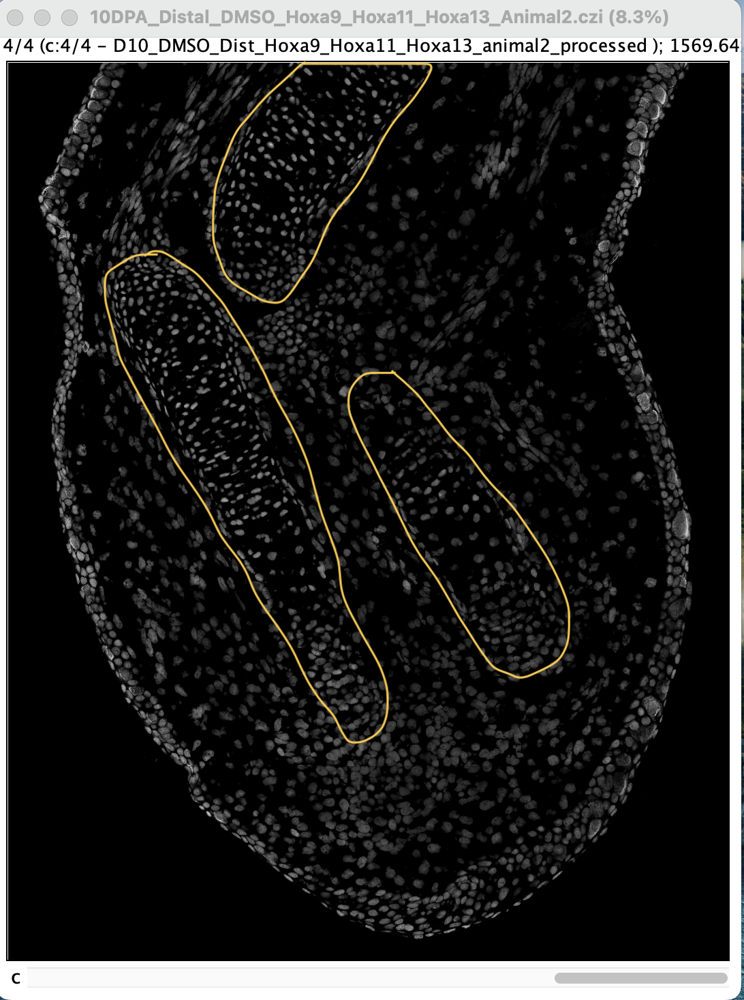

Instructions for processing images
================

### Overview

Below you will find the steps that need to be run for each raw image to
isolate tissues into Blastema, Mesenchyme, and Epithelium. It will make
your life a lot easier when files are named consistently, including
capitalization.

**DO NOT** under any circumstances crop the images or otherwise change
their dimensions (zooming in and out is fine).

### Steps

In this example, I’ll be starting with
`10DPA_Proximal_DMSO_Raldh1_Raldh2_Raldh3_Animal5.czi`.

1.  Download the image from OneDrive.
    -   It will be a LARGE file. Make sure you have room on your
        computer!
    -   Each image is a whole limb from a proximal or distal amputation
        taken with 4 channels: 1 color channel for each gene (total 3),
        and one grayscale DAPI channel.
2.  Open the image with FIJI. If a screen pops up with
    `Bio-Formats Import Options` at the top, change the settings to
    match these exactly:

3.  Click `OK`. You can ignore any warning messages that pop up in the
    `Console` window. The colors might not be very bright, and that’s
    okay - **don’t adjust the brightness!**

4.  Using the scroll bar below the image, look for any issues with
    stitching. This should be pretty apparent in the DAPI channel, and
    will appear as a “seam” on the image like this:

If you see this, do not go further with this image; it will need to be
re-stitched **unless the stitching error is not on the tissue,
especially in the blastema**. If you encounter the following “walls of
color” with or without evident seams like below, this is **not a
problem** again if the bad stitch is not on the tissue (note the tile on
the middle-right):

5.  Split the image channels:
    

You should end up with four image windows, each of a different color
channel. Here are some side-by-side (edited to show up brighter):

6.  **Save each window** from step 5 as a **new** `.tif` (`File` -\>
    `Save As` -\> `Tiff...`). Name each of these images with the
    original file name, but add `_Whole_Limb_GeneName.tif` at the end.
    FIJI will add a channel number like `C1-` to the beginning of each
    file, so be sure to delete this too.
    -   `GeneName` is based on the channel color. Each gene set has
        three colors: magenta, yellow, and cyan, then the DAPI channel
        in grayscale.
    -   There is a list of the colors for each gene set on OneDrive!

If the color is not bright enough to identify the channel by sight, look
in the top left corner of the image. There should be an indication of
`1/4`, `2/4`, `3/4`, or `4/4`:

These correspond to the channels, which happen to be the gene names in
order. In this example, with
`10DPA_Proximal_DMSO_Raldh1_Raldh2_Raldh3_Animal5.czi`, this means that
`1/4` is `Raldh1`, `2/4` is `Raldh2`, `3/4` is `Raldh3`, and `4/4` is
`DAPI`.

**At the end of step 6** you should now have:

-   Your original image. Here it’s
    `10DPA_Proximal_DMSO_Raldh1_Raldh2_Raldh3_Animal5.czi`.
-   Four new `.tif` files, one for each channel:
    -   `10DPA_Proximal_DMSO_Raldh1_Raldh2_Raldh3_Animal5_Whole_Limb_Raldh1.tif`
    -   `10DPA_Proximal_DMSO_Raldh1_Raldh2_Raldh3_Animal5_Whole_Limb_Raldh2.tif`
    -   `10DPA_Proximal_DMSO_Raldh1_Raldh2_Raldh3_Animal5_Whole_Limb_Raldh3.tif`
    -   `10DPA_Proximal_DMSO_Raldh1_Raldh2_Raldh3_Animal5_Whole_Limb_DAPI.tif`

You can now close all of these files.

7.  Re-open **the original image**, here
    `10DPA_Proximal_DMSO_Raldh1_Raldh2_Raldh3_Animal5.czi`.

8.  Using the freehand selection tool while the scroll bar is in the
    **DAPI** channel, draw **along the amputation plane** and around the
    outside of the tissue, trying not to cut cells in half. See the very
    end of this file for ways to identify the amputation plane.

9.  Click `Edit` -\> `Clear Outside` to remove anything outside of this
    boundary. There will be a pop-up window asking if you want to apply
    this to all images, select `Yes`. This is so we separate the
    blastema tissue from the rest of the limb.

10. **Save this image** as a **new** `.tif` with the original file name,
    but add `_Blastema_All_Channels.tif` to the end.

-   In this example, this is
    `10DPA_Proximal_DMSO_Raldh1_Raldh2_Raldh3_Animal5_Blastema_All_Channels.tif`.

11. Like you did earlier, use the `Split Channels` function to divide
    the blastema selection into the four channels:

12. **Save each channel** as its own **new** `.tif`, with the original
    file name, adding `_Blastema_GeneName.tif` to the end again as you
    did above. Again refer to the channel number in the upper left
    corner if you need.

**After step 12** you should now have the following new images:

-   `10DPA_Proximal_DMSO_Raldh1_Raldh2_Raldh3_Animal5_Blastema_All_Channels.tif`
-   `10DPA_Proximal_DMSO_Raldh1_Raldh2_Raldh3_Animal5_Blastema_Raldh1.tif`
-   `10DPA_Proximal_DMSO_Raldh1_Raldh2_Raldh3_Animal5_Blastema_Raldh2.tif`
-   `10DPA_Proximal_DMSO_Raldh1_Raldh2_Raldh3_Animal5_Blastema_Raldh3.tif`
-   `10DPA_Proximal_DMSO_Raldh1_Raldh2_Raldh3_Animal5_Blastema_DAPI.tif`

13. Open the **`_Blastema_DAPI` image** from Step 12.
    

14. Using the freehand tool, draw along the inner edge of the epithelium
    and around the mesenchyme:
    

15. Use `Clear Outside`, then **save this image** as a **new** `.tif`
    with the original file name, adding `_Mesenchyme_DAPI.tif` to the
    end.

In this example, this is
`10DPA_Proximal_DMSO_Raldh1_Raldh2_Raldh3_Animal5_Mesenchyme_DAPI.tif`.

16. Use `Edit` -\> `Undo`, then use `Clear`. **Save this image** as a
    **new** `.tif`, with `_Epithelium_DAPI.tif`.

In this example, this is
`10DPA_Proximal_DMSO_Raldh1_Raldh2_Raldh3_Animal5_Epithelium_DAPI.tif`.

### Results

After all of these steps, you should now have the following **12**
images:

1.  The **original** unaltered image in `.czi` format.

-   Ex: `10DPA_Proximal_DMSO_Raldh1_Raldh2_Raldh3_Animal5.czi`.

2.  Four new `Whole_Limb` images, one per channel, in `.tif` format.

-   `10DPA_Proximal_DMSO_Raldh1_Raldh2_Raldh3_Animal5_Whole_Limb_DAPI.tif`
-   `10DPA_Proximal_DMSO_Raldh1_Raldh2_Raldh3_Animal5_Whole_Limb_Raldh1.tif`
-   `10DPA_Proximal_DMSO_Raldh1_Raldh2_Raldh3_Animal5_Whole_Limb_Raldh2.tif`
-   `10DPA_Proximal_DMSO_Raldh1_Raldh2_Raldh3_Animal5_Whole_Limb_Raldh3.tif`

3.  Five new `Blastema` images, one with `All_Channels` and one for each
    of four individual channels, in `.tif` format.

-   `10DPA_Proximal_DMSO_Raldh1_Raldh2_Raldh3_Animal5_Blastema_All_Channels.tif`
-   `10DPA_Proximal_DMSO_Raldh1_Raldh2_Raldh3_Animal5_Blastema_DAPI.tif`
-   `10DPA_Proximal_DMSO_Raldh1_Raldh2_Raldh3_Animal5_Blastema_Raldh1.tif`
-   `10DPA_Proximal_DMSO_Raldh1_Raldh2_Raldh3_Animal5_Blastema_Raldh2.tif`
-   `10DPA_Proximal_DMSO_Raldh1_Raldh2_Raldh3_Animal5_Blastema_Raldh3.tif`

4.  One new `_Mesenchyme_DAPI.tif`.

-   `10DPA_Proximal_DMSO_Raldh1_Raldh2_Raldh3_Animal5_Mesenchyme_DAPI.tif`

5.  One new `_Epithelium_DAPI.tif`.

-   `10DPA_Proximal_DMSO_Raldh1_Raldh2_Raldh3_Animal5_Epithelium_DAPI.tif`

### Tips for finding the amputation plane

As you process images, you’ll develop a better eye for finding the
amputation plane, but you can always ask if you aren’t sure. There is no
perfect standard for determining what cells lie above and below this
plane, but there are a few guidelines to help make it as accurate as
possible. The bone is the best indication **but not foolproof**. Bone
cells are more “regular” than the jumble of mesenchymal tissue. They
tend to appear to be stacked in layers, with dense lines of cells on the
sides.

**In a proximal amputation**, the humerus will be somewhat centrally
located. Using the example image above,
`10DPA_Proximal_DMSO_Raldh1_Raldh2_Raldh3_Animal5.czi`, here’s what to
look for (with the amputation plane I drew earlier, for reference):

In this outline, you can see some nice dense cells on the right side of
where I’ve outlined. Within the more central portion, the cells are well
stratified. The very end of this bone is the amputation plane, and you
can see that the dense line of cells does not continue farther down from
here. Using this as a guide, you can more or less draw across with your
freehand tool to isolate the blastema.

**In a distal amputation**, there will be two smaller bones: the radius
and ulna. Here is an unmarked example,
`10DPA_Distal_DMSO_Hoxa9_Hoxa11_Hoxa13_Animal2.czi`, with the radius and
ulna (and humerus :)) marked next to it:

If you are still looking at your DAPI image and wondering where the
bones are, there is another last-resort trick you can use.

1.  Open your image, and pick any channel that isn’t DAPI.
2.  Go to `Image` -\> `Adjust` -\> `Brightness / Contrast`:
    

A little window like this will pop up next to your image:

3.  Slowly drag the `Maximum` slider to the left. As you do this, your
    image should become brighter and brighter. Here I’m using
    `10DPA_Distal_DMSO_Hoxa9_Hoxa11_Hoxa13_Animal2.czi` in the `Hoxa9`
    channel:
    

Now you should very clearly be able to see where the ends of the bones
are. In the proximal
`10DPA_Proximal_DMSO_Raldh1_Raldh2_Raldh3_Animal5.czi` image from
earlier, the `Raldh1` channel looks like this:

This trick **is not perfect** - there are some sections where you might
not see much bone at all. But this might help guide where you draw your
lines, and use your best judgment. **DO NOT SAVE THESE IMAGES IF YOU
CHANGE ANY BRIGHTNESS!!! Adjusting the brightness very much changes the
data being collected.** Once you’ve done this and have a better idea
where the amputation plane is, **CLICK RESET and start over**.
