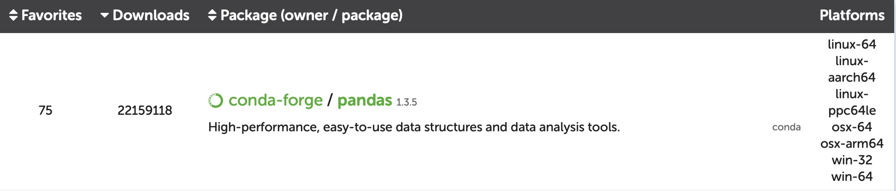

Anaconda Package Manager
================

-   [Overview](#overview)
-   [Starting with Anaconda on
    Discovery](#starting-with-anaconda-on-discovery)
-   [Navigating Environments](#navigating-environments)
    -   [Browse Your Environments](#browse-your-environments)
    -   [Activate Environments](#activate-environments)
    -   [Manage Environments](#manage-environments)
-   [Working with Packages](#working-with-packages)
    -   [The Package Repository](#the-package-repository)
    -   [Browse Packages](#browse-packages)
        -   [Note: Channels](#note-channels)
    -   [Install Packages](#install-packages)
    -   [Update Packages](#update-packages)
-   [Additional Flags](#additional-flags)
-   [Additional Resources](#additional-resources)
-   [What to Do Now](#what-to-do-now)

## Overview

Discovery has a lot of useful software, but it is by no means
exhaustive, so you need a way to acquire more software for your work.
Anaconda is a large, open-source environment and package manager that
you can access locally and through Discovery. There are many different
managers out there, including some others available on Discovery, but
Anaconda has [a huge repository of packages that are available to browse
and download for free](https://anaconda.org/anaconda/repo) as well as [a
local desktop application](https://www.anaconda.com/products/individual)
that allows you to do the same management independent of the command
line.

## Starting with Anaconda on Discovery

Anaconda is [available as a module on
Discovery](https://rc-docs.northeastern.edu/en/latest/software/conda.html)
that you must load in order to use:

``` bash
$ module load anaconda3/3.7
```

## Navigating Environments

I first mentioned environments in [the introduction to the command
line](The_Command_Line_and_Vim.md) when discussing the `base`
environment. An *environment* groups packages together into one
functional “space”. When you install a package, it usually doesn’t
install alone; packages often require *other* packages in order to
execute their commands. Installing a package through Anaconda will also
automatically install that package’s *dependencies*. Using environments
avoids package incompatibility. For example, the `salmon` package for
transcript abundance quantification is currently at version 1.6.0 if you
were to download it through the Anaconda package repository. However, if
you downloaded the `Trinity` package for RNA-seq analysis into the same
environment, you would encounter a conflict. This is because `Trinity`
*depends on* `salmon` version 0.13.1. To avoid headaches, and in fact
for either package to function, you would put `Trinity` and the newest
`salmon` in separate environments.

#### Browse Your Environments

To see what environments you have, use:

``` bash
$ conda env list
```

Or

``` bash
# You can also use -e instead of --envs.
$ conda info --envs
```

This will list the name of the environment and its location. The
location will be something like
`/home/<username>/.conda/envs/<environmentname>`. However, if you try to
find this location by going to your home directory, you won’t see
`.conda` in there if you use `ls`, because it’s hidden. To see all
directories, including hidden directories, use `ls -a`.

#### Activate Environments

To activate a certain environment, after you’ve loaded `anaconda3/3.7`
with `module`, use:

``` bash
$ source activate <environment>
```

If you have `conda` on your local computer, you can use
`conda activate`. `conda` is not configured on Discovery to use
`activate`, so use `source` instead.

To return to your base environment, you can use:

``` bash
$ source activate base
```

Or

``` bash
$ source activate
```

You don’t have to return to your base environment in order to activate a
different environment. You can use `source activate <environment>` from
any location.

To deactivate your current environment, which will reactivate your
previous environment, use:

``` bash
# Note conda is used here.
# source deactivate will work, but you'll receive a warning message.
$ conda deactivate <environment>
```

Or

``` bash
$ conda deactivate
```

#### Manage Environments

To create a new environment, use:

``` bash
# You can also use --name instead of -n .
$ conda create -n <environment-name>
```

To delete an environment *and all of its packages*:

``` bash
# Remove the --all flag to only remove the environment
$ conda remove -n <environment-name> --all
```

To update all packages in an environment:

``` bash
# Use at your own risk, may create inconsistencies
$ conda update -n <environment-name> --all
```

## Working with Packages

*Packages* are essentially bundles of commands with some kind of common
purpose that your computer can recognize and use to perform certain
functions. For example, `pandas` is a data analysis package that makes
it really easy to work with spreadsheets, while `NumPy` is useful for
mathematics-heavy data manipulation.

#### The Package Repository

Anaconda maintains [a large repository of
packages](https://anaconda.org/anaconda/repo) available for
installation. When you search for a particular package, in this example
`pandas`, this is what you will see:
<!-- -->

The first two columns aren’t super important, however if there are
multiple sources available the download number might indicate which is
the best. The middle column tells you the [channel](#note-channels) that
package is available through, then the package name and its version.
Underneath is a short description of the package. On the far right are
the platforms that package is supported by. If you click on the package
name, you will come to a page will additional information, installation
commands, and often links to the package documentation.

#### Browse Packages

To see all of the packages you have installed in any environment, you
can list the contents of the `pkgs` directory.

``` bash
$ ls /home/<username>/.conda/pkgs
```

To see the packages installed in a specific environment, use:

``` bash
# To see the packages in the current environment, just use 'conda list'. 
$ conda list -n <environment-name>
```

To see specific packages with a certain name, use:

``` bash
# Include -n <environment-name> to search in a particular environment.
$ conda list <package-name>
```

##### Note: Channels

*Channels* are locations in the Anaconda package repository from which
packages are downloaded. There is a default Anaconda channel, but there
are several others, such as `bioconda` and `conda-forge`, which host
packages that the default channel may not. Channels are stored as a list
of URLs that Anaconda searches for the desired package. If you attempt
to install a package from a channel not within the list stored for your
user, you will receive an error.

To display the currently available channels, use:

``` bash
$ conda config --show channels
```

In order to add a channel to your list of channels, use:

``` bash
$ conda config --append channels <channel-name>
```

#### Install Packages

To install new packages to an environment, use:

``` bash
# Anaconda will by default install the most recent package version.
# To install in the current environment, you don't need '-n <environment-name>'.
# To install from the default channel, you don't need '-c <channel-name>'.
# To install a specific package version, use <package>=<version> .
$ conda install -n <environment-name> -c <channel-name> <package-name>
```

#### Update Packages

To update packages:

``` bash
# There are several flags that can be used here, so check the --help page for more information. 
$ conda update -n <environment-name> <package-name>
```

## Additional Flags

Along with the commands shown above, there are several other flags you
can include. These two are common and useful:

-   `-d` or `--dry-run` will not run anything. Instead, you are shown
    the output of what would have been done. This is useful for checking
    for inconsistencies!

-   `-y` or `--yes` will automatically say “yes” to all questions from
    Anaconda including about package updates, etc. Use at your own risk,
    but you can run a dry run first to check.

You can find information for all of the commands and flags you can run
with Anaconda using:

``` bash
$ conda --help
```

## Additional Resources

-   [Anaconda documentation](https://docs.anaconda.com/anaconda/)
-   [freeCodeCamp: Intro to Anaconda (through
    Ubuntu)](https://www.freecodecamp.org/news/how-to-install-anaconda-on-ubuntu-16-04-64-bit-6f1c4675ce44/)
-   [Academind: Anaconda for Python - What & Why? (26
    mins)](https://youtu.be/23aQdrS58e0)

## What to Do Now

Practice with Anaconda on Discovery, including creating and navigating
environments, and consider downloading [the Anaconda desktop
application](https://www.anaconda.com/products/individual) for use on
your local computer. Check out [the package
repository](https://anaconda.org/anaconda/repo) and try searching for
some.
