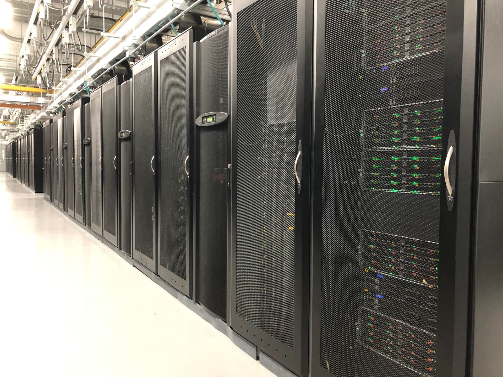
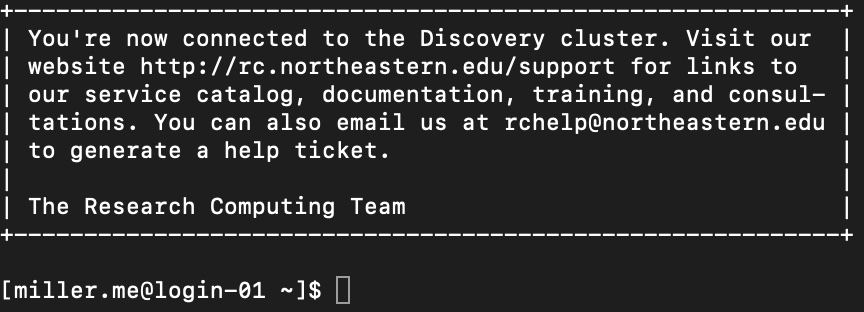

High-Performance Computing with Discovery
================

-   [Overview](#overview)
    -   [“Local” versus “Remote”](#local-versus-remote)
    -   [What is Discovery?](#what-is-discovery)
    -   [Getting Access to Discovery](#getting-access-to-discovery)
    -   [Logging in to Discovery using
        Mac](#logging-in-to-discovery-using-mac)
    -   [Logging in to Discovery using
        Windows](#logging-in-to-discovery-using-windows)
    -   [When you first log in](#when-you-first-log-in)
    -   [Resources available on
        Discovery](#resources-available-on-discovery)
        -   [Some Computer Vocab](#some-computer-vocab)
        -   [Hardware](#hardware)
            -   [Partitions](#partitions)
        -   [Software](#software)
            -   [Using `module`](#using-module)
        -   [Slurm](#slurm)
            -   [Using `srun`](#using-srun)
            -   [Using `sbatch`](#using-sbatch)
    -   [Additional Resources](#additional-resources)
    -   [What to Do Now](#what-to-do-now)

## Overview

This introduction is intended to give an overview of the Discovery
cluster. I will cover the basics of high performance computing (HPC),
why we use a computer cluster, and then get into the specifics of
Discovery. This is an overview rather than a comprehensive walk-through,
so if you need help or want to learn more about Discovery, visit [the
documentation](https://rc-docs.northeastern.edu/en/latest/). If you have
a specific question or issue with Discovery, [check out Northeastern
tech support](https://rc.northeastern.edu/support/).

### “Local” versus “Remote”

Your *local computer* is the computer you are using right now. It has a
hard drive with a certain memory capacity and other specs which together
contribute to its computing power. Your computer is more powerful than
you might think, but it isn’t enough to work with the volume of data
that tends to be generated by techniques like RNA Sequencing. This is
where a *remote* server becomes important. Remote servers are called
“remote” because you access them remotely - that is, through your
[command line](The_Command_Line_and_Vim.md) - and all of your access to
this server will be entirely conducted through the command line
interface. Clusters like Discovery have the resources necessary to
handle computationally intensive programs, and when you run a program
with Discovery you request that certain resources be allotted to your
work.

### What is Discovery?

From the Northeastern research computing website:

> “Discovery is a high performance computing (HPC) resource for the
> Northeastern University research community. The Discovery cluster is
> located in the Massachusetts Green High Performance Computing Center
> (MGHPCC) in Holyoke, MA. MGHPCC is a 90,000 square-foot, 15 megawatt
> research computing and data center facility that houses computing
> resources for five institutions: Northeastern, BU, Harvard, MIT, and
> UMass.”

The Discovery cluster *is* a physical location with many huge computers,
but you will (probably) never actually see or touch them yourself.
Instead, your entire interaction with Discovery will be through your
command line. All of the files and directories are stored on Discovery’s
servers, and running a program in Discovery won’t do anything on your
local computer. The only resources your computer uses are the very few
necessary to connect to Discovery. When you’re finished, you simply
disconnect.

The computers of a remote server aren’t like the laptop or desktop
system you might be working on right now. This is what they look like:



### Getting Access to Discovery

To get access to Discovery, you need to [submit a
ticket](https://its.northeastern.edu/support/). Fill in the application
form, with James as your “University Sponsor”. You’ll get a response
about approval within the next day or so, and make sure James knows
you’re requesting access because he needs to approve your request too.

### Logging in to Discovery using Mac

Once you have access, the easiest way to connect to Discovery is through
Terminal. If you’re using a different application, or use something
called “X11 forwarding” check out [this
page](https://rc-docs.northeastern.edu/en/latest/first_steps/connect_mac.html)
for some extra steps you’ll need to take. You can log in to Discovery
using:

``` bash
$ ssh <username>@login.discovery.neu.edu

# If you use X11 forwarding
$ ssh -Y <username>@login.discovery.neu.edu
```

`ssh` stands for “secure shell”, and `<username>` is your NEU username.
Hit `enter`, then you’ll be prompted for your Northeastern password. The
cursor might not move while you’re typing, so be careful to type it in
correctly. Hit `enter` again, and you will receive a screen indicating
that you’re now connected. Log out by typing `exit` and hitting `enter`.
To set up your log in so you don’t have to enter any password, which
will also help you avoid errors if you’re using an application other
than Terminal, follow these steps:

1.  Open Terminal. Type `cd ~/.ssh` and hit `enter`.
2.  Type `ssh-keygen -t rsa` and hit `enter`. This will create `id_rsa`
    and `id_rsa.pub`.
3.  Hit `enter` for all following prompts. Do not generate a passphrase.
4.  Type
    `ssh-copy-id -i ~/.ssh/id_rsa.pub <username>@login.discovery.neu.edu`
    and hit `enter`. You may need to enter your Northeastern password.
5.  Log in to Discovery using `ssh <username>@login.discovery.neu.edu`.
6.  Type `cd ~/.ssh ; cat id_rsa.pub >> authorized_keys`.
7.  Log out with `exit`.
8.  Reconnect to Discovery with
    `ssh <username>@login.discovery.neu.edu`.
9.  Type `cd ~/.ssh` and hit `enter`.
10. Type `ssh-keygen -t rsa` and hit `enter`.
11. Hit `enter` for all following prompts. Do not generate a passphrase.
    If you are asked to overwrite a file, press `Y`.
12. Type `cat id_rsa.pub >> authorized_keys` and hit `enter`.

Now you can log in to Discovery without entering a password. If you want
help with these steps, [contact IT](mailto:rchelp@northeastern.edu).

### Logging in to Discovery using Windows

Connecting to Discovery with Windows is a little more complicated. Your
typical Command Prompt may not work, so to avoid issues it is
recommended to download a program such as
[MobaXterm](https://mobaxterm.mobatek.net/). MobaXterm is recommended
because it allows for file sharing between your local computer and the
remote server and allows for the use of Unix commands. Follow the
instructions on [this
page](https://rc-docs.northeastern.edu/en/latest/first_steps/connect_windows.html)
to learn how to connect with MobaXterm and set up a passwordless SSH
like above. There is also an instructional video. If you need help with
these steps, [contact Northeastern IT](mailto:rchelp@northeastern.edu).

### When you first log in

Once you’ve gotten access to Discovery and set up a passwordless SSH,
run:

``` bash
$ ssh <username>@login.discovery.neu.edu
```

If you’ve successfully connected, you will see this in your command
line: <!-- -->

At the top is a short message from the RC team. Below that is a line
containing `[<username>@login-01 ~] $`. Note that there is no
environment indicated, but you are in your base environment. The
bracketed information says you are on a *login node* in your home
directory. Recall from [the introduction to the command
line](The_Command_Line_and_Vim.md) that `~` is short for
`/home/<username>`. Your home directory is **not** meant for any
computational work. Instead, it has a limited storage of 100GB that is
intended to store things like [Anaconda environments](Anaconda.md) and
miscellaneous packages that you need for other work. To store things
temporarily for your analyses, a user folder in the `/scratch` directory
is created for you upon gaining access to Discovery. This directory
automatically purges things that haven’t been used for 30 days. But what
if you need to hold on to stuff for longer? There is another directory,
`/work`, where PIs own directories for permanent storage. You will need
to [request a personal directory in James’s `/work`
directory](https://its.northeastern.edu/support/) in order to store
things here.

After you log in to Discovery, before you begin any computation, you
should [move to a compute node](#using-srun).

### Resources available on Discovery

##### Some Computer Vocab

Before I introduce what is available to you on Discovery, it’s important
to cover some basic computer terms to understand what exactly you’re
accessing.

-   **CPU**: This stands for Central Processing Unit. CPUs coordinate
    the execution of calculations, but they can’t act alone. Instead,
    they interact with the RAM and other aspects of the hardware in
    order to translate and execute commands.
-   **GPU**: This stands for Graphics Processing Unit, and is related to
    the CPU. As the name suggests, GPUs are specialized towards the
    creation and manipulation of graphics such as videos and images.
-   **Processor**: An umbrella term for a processing unit like a CPU or
    GPU.
-   **Core**: The main component of the CPU where the calculations are
    done. A CPU can have multiple cores.
-   **Node**: a single computer. There are different kinds of nodes on
    Discovery, notably “login” and “compute” nodes. I will give a little
    more detail on this when talking about [`srun`](#using-srun).
-   **RAM**: This stands for Random Access Memory. It’s different from
    general data storage, because it’s where short-term information is
    held while a program is running so it can be accessed quickly. Too
    little RAM, and your program will run slowly or even crash. Too much
    RAM isn’t necessarily “bad”, but it doesn’t have much added benefit
    and could impact [when your job is scheduled to run](#using-sbatch).
-   **Parallel**: Running programs on multiple cores/CPUs, where each
    core handles its own independent piece of the program or data.
-   **Thread**: A small portion of a program handled by the CPU.
    *Multi-threading* is set up such that each core handles its own
    thread. This can considerably speed up a program’s run time.
-   **Partition**: A group of *nodes* with different allotted resources.
    Splitting nodes into partitions helps to distribute resources
    efficiently.
-   **Job**: your program. With each job, you can specify a particular
    partition and other resources.
-   **Resource Manager**: A software that allots resources such as cores
    and RAM to jobs. On Discovery, this is done by [Slurm](#slurm).

#### Hardware

##### Partitions

As stated above, partitions are groups of nodes with different resources
available. On Discovery, there are 4 partitions requiring no approval
and 3 which do require approval for special use. Below is a summary, but
you can [find more information
here](https://rc-docs.northeastern.edu/en/latest/hardware/partitions.html).

| Partition | Approval? | Max run time | Core limit per user | RAM limit |
|:---------:|:---------:|:------------:|:-------------------:|:---------:|
|   debug   |    No     |   20 mins    |         128         |   256GB   |
|  express  |    No     |   60 mins    |        2048         |   25TB    |
|   short   |    No     |    24 hrs    |         128         |   25TB    |
|   long    |    Yes    |    5 days    |        1024         |   25TB    |
|   large   |    Yes    |    6 hrs     |        None         |   None    |

**GPU Partitions:**

| Partition | Approval? | Max run time | GPU limit (job/user) |
|:---------:|:---------:|:------------:|:--------------------:|
|    gpu    |    No     |    8 hrs     |         1/8          |
| multigpu  |    Yes    |    24 hrs    |        12/12         |

Specifics on the CPUs available on Discovery [can be found
here](https://rc-docs.northeastern.edu/en/latest/hardware/hardware_overview.html).

#### Software

There are many different software packages available on Discovery, but
it is also fairly simple in most cases to install new software as
needed. You can find information on [installing packages using Anaconda
here](Anaconda.md).

##### Using `module`

The `module` command can be used to view available software and its
details, load and unload packages, and view loaded software.

To view all packages available on Discovery and their versions:

``` bash
$ module avail
```

To view packages loaded in your current environment:

``` bash
$ module list
```

To load a package:

``` bash
$ module load <package>
```

To unload a package:

``` bash
$ module unload <package>
```

To view details about a package:

``` bash
$ module show <package>
```

To unload *all* software from the current environment:

``` bash
$ module purge
```

**Note**: `module purge` *includes* purging the default `discovery`
module. You can reload it using `module load discovery`.

#### Slurm

Slurm, or Simple Linux Utility Resource Management, is the resource
manager software used on Discovery. You can [find more information
here](https://rc-docs.northeastern.edu/en/latest/using-discovery/usingslurm.html).
Below is a summary of Slurm commands.

|             Command              |               Function               |
|:--------------------------------:|:------------------------------------:|
|        `sinfo <options>`         |    Shows partition and node info     |
|         `smap <options>`         |       Visualizes cluster info        |
|         `srun <options>`         |        Run an interactive job        |
|      `sbatch <scriptname>`       |       Submit job to scheduler        |
|        `scancel <jobid>`         |              Cancel job              |
|          `seff <jobid>`          | View computational stats about a job |
|      `squeue -u <username>`      |  View running jobs for `<username>`  |
| `scontrol show jobid -d <jobid>` |    Show information for `<jobid>`    |

##### Using `srun`

`srun` is for running interactive jobs on Discovery. When you first log
in, you are on a *login* node. To do any work, regardless of its
computational intensity, you need to move to a *compute* node using
`srun`. When you use `srun`, you specify certain parameters for your
session with a set of flags. Below are the most basic flags. You can
[find more information on using `srun`
here](https://rc-docs.northeastern.edu/en/latest/using-discovery/srun.html),
or you can find all options for `srun` using `$ srun --help`.

To move to a compute node with default settings, use:

``` bash
# This will give you a maximum of 4 hours
$ srun --pty /bin/bash
```

|     Flag      |     What is specified     |            Options            |
|:-------------:|:-------------------------:|:-----------------------------:|
| `--partition` |     Partition to use      | See [Partitions](#partitions) |
|   `--nodes`   |  Number of nodes to use   |           Maximum 2           |
|    `--mem`    | Request additional memory |   Max. depends on partition   |
|   `--time`    | Time allotted (HH:MM:SS)  |   Max. depends on partition   |

For example, to request 7.5 hours on the short partition with 10
gigabytes of extra memory and 2 nodes, use:

``` bash
$ srun --partition=short --nodes=2 --mem=10G --time=7:30:00 --pty /bin/bash
```

The `--pty /bin/bash` flag is a default to run your interactive session
in the current command line window with a bash shell. Always include
this. To exit your interactive session and move back to a login node,
use `$ exit`. You will need to use `$ exit` a second time in order to
fully disconnect from Discovery.

##### Using `sbatch`

`sbatch` is akin to `srun`, except it is to allocate resources and
schedule jobs you want to run in the background, i.e., programs that you
don’t want or need to monitor. The same resources that are available
using `srun` are available with `sbatch`, but they are allocated on a
job-by-job basis rather than in one interactive session. Specifying
`sbatch` parameters is done at the top of your script instead of in the
command line. Here is an example header of a script requesting the same
resources as the above `srun` example using `sbatch`:

``` bash
#!/bin/bash
#SBATCH --nodes=1
#SBATCH --partition=short
#SBATCH --mem=10G
#SBATCH --time=7:30:00
#SBATCH --job-name=Example
```

Note that one major difference using `sbatch` is the inclusion of a “job
name”. This is so, when you check on your running jobs, you are able to
tell which is which. There’s no “correct” way to name a job, but short
and descriptive will make your life easier. When you submit a job with
`sbatch`, it will give you an ID for that job. This ID will also be
attached to the log file that is automatically generated to contain the
standard output of your job. This ID can also be used with `seff` or
`scancel` to review the stats about a job or to cancel a job,
respectively.

To monitor your currently running jobs, use `squeue -u <username>`. The
output will look similar to below: <!-- -->

This output is for an interactive `srun` session I have running in a
separate terminal. Each column gives you some information about your
job: - `JOBID` is exactly that: the ID for that job. - `PARTITION` is
the partition that job is running on. - `NAME` is the name specified by
`--job-name`. In this case, `bash` indicates that it is my `srun`
session in a `bash` shell. - `USER` is the username that job belongs to.
It should always be your own username if you specified
`-u <username>`. - `ST` indicates the job’s status. The most common
statuses are `PD` for “pending”, `R` for “running”, and `CD` for
“completed”. You might encounter others, typically based on various run
failures. - `TIME` indicates how long that job has been running. This is
not the same as the time since submitting the job. - `NODES` are the
number of nodes that job is using. - `NODELIST(REASON)` lists the nodes
used by that job. Each node in Discovery has a name, and it’s possible
to specify which node you want to use, but for our purposes it’s not
important.

### Additional Resources

-   [Discovery
    documentation](https://rc-docs.northeastern.edu/en/latest/)
-   [Research Computing at Northeastern](https://rc.northeastern.edu)

### What to Do Now

You should check out [the documentation for
Discovery](https://rc-docs.northeastern.edu/en/latest/) to see what’s
available to you, as well as to practice with navigating documentation.
Northeastern IT also [hosts various training
sessions](https://rc.northeastern.edu/support/training/) as well as
introductory training.
