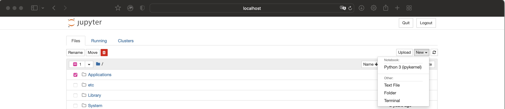
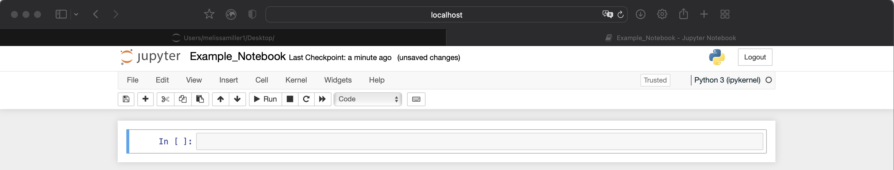

Jupyter Notebook
================

-   [Overview](#overview)
    -   [Installing Jupyter Notebook](#installing-jupyter-notebook)
    -   [Launching Jupyter Notebook](#launching-jupyter-notebook)
    -   [Working in Jupyter](#working-in-jupyter)
    -   [The home screen](#the-home-screen)
    -   [The notebook interface](#the-notebook-interface)
    -   [Scripting in Jupyter Notebook](#scripting-in-jupyter-notebook)
        -   [Note: the kernel](#note-the-kernel)
    -   [Exiting Jupyter](#exiting-jupyter)
-   [What to do now](#what-to-do-now)

## Overview

Jupyter Notebook is a popular and easy-to-use browser-based interface
for writing and running code. Notebooks are powerful and user-friendly,
so I highly recommend Jupyter both as a way to practice coding skills
and for producing some really cool outputs.

#### Installing Jupyter Notebook

If you have [Anaconda](Anaconda.md) installed, you can install Jupyter
in your desired environment using:

``` bash
# You can add the -n <environment> flag to install to a particular environment
# that you aren't currently in. Default will install to current environment.
$ conda install -c conda-forge notebook
```

If you have the Anaconda desktop application installed, you can skip the
command line all together. To install Jupyter with the Anaconda
Navigator application:

1.  Launch the Anaconda Navigator application.
2.  Click the drop-down menu on the home screen to select the desired
    environment.
3.  You should see blocks for both Jupyter Lab and Jupyter Notebook.
    Click “Install” under Jupyter Notebook and wait.

If you do not have Anaconda but would like to install Jupyter, you can
use Python’s preferred package manager `pip`. If you [installed Python
from the Python website](https://www.python.org/downloads/), `pip` is
installed with it. To install Jupyter Notebook using `pip`:

``` bash
$ pip install notebook
```

#### Launching Jupyter Notebook

Once you have Jupyter Notebook installed on your computer, you can
launch Jupyter from your command line using:

``` bash
$ jupyter notebook
```

This will open a new browser window with a file-navigating system
similar to those which you are likely familiar with (Finder on Mac, File
Explorer on Windows).

If you have Anaconda Navigator installed on your computer, you can again
skip the command line:

1.  Launch the Anaconda Navigator application.
2.  Click the drop-down menu on the home screen and select the
    environment where you installed Jupyter Notebook.
3.  Click “Launch” under Jupyter Notebook. This will open a browser
    window.

#### Working in Jupyter

#### The home screen

After Jupyter launches in a browser window, you’ll be on a file browsing
system that opens in the working directory.
<!-- -->

Click the drop down menu in the top right. There you have the ability to
create a new notebook and a few other options, including a new folder.
If you select one or more items, as I have in this screenshot, you have
the ability to rename, move, and trash files. The middle bar, where
there’s a folder icon, displays the [working
directory](The_Command_Line.md). If you click the “New” drop-down menu,
you’ll see a few options for items you can create. For now, click the
Python you have under “Notebook”. If you have the option between Python
versions, select the most recent version.

#### The notebook interface

<!-- -->

Once in your new notebook, you’ll be in a screen that might look like
some word processing software you’re familiar with, like Microsoft Word,
except for a few key differences indicating Jupyter’s scripting
capability. Click “Help”, select “User Interface Tour” in the drop down
menu, and then make your way through the tour provided.

#### Scripting in Jupyter Notebook

Install `matplotlib`, `plotly`, and `numpy` into your environment. This
can be done with `conda` or `pip`:

``` bash
## matplotlib
# Remember you can install it in a particular environment using -n <environment>
$ conda install matplotlib

# with pip:
$ python -m pip install -U matplotlib
```

``` bash
# plotly
$ conda install -c conda-forge plotly

# Using pip:
$ pip install plotly==5.5.0
```

``` bash
# Numpy
$ conda install numpy

# Using pip:
$ pip install numpy
```

Download and open the [example notebook](Example_Notebook.ipynb) file in
Jupyter. Instructions for how to download files from GitHub are on the
`lab-resources` home page.

The first section of the notebook covers formatting in Markdown, a
language for formatting text that is supported by GitHub, Jupyter,
RStudio, and others. What you are currently reading was written in
“R-Markdown” through RStudio and rendered as a GitHub document.

The second section includes some basics of scripting in Python with
Jupyter. This is not intended for practicing language skills, just to
demonstrate what’s available in Jupyter. There are some spots to edit if
you want to practice though :)

The final section is a little more advanced, but still useful to know.
This section covers what Jupyter calls “cell magic” and “line magic”,
which are certain commands that broaden Jupyter’s interaction with your
computer.

##### Note: the kernel

By now you’ve encountered the word “kernel” several times. Your notebook
is using an “ipykernel”, there’s a whole drop down dedicated to actions
you can perform on the kernel, and the user interface tour showed you
how to see if the kernel is active.

The *kernel* bridges the hardware and software of your computer. It is
the first thing to load, the last thing to shut down, and directs
everything in between. A kernel decides what resources to use on certain
processes and has some amount of memory for the hardware to access in
order to carry out these processes. It is about as close to the actual
silicon computer chip as you can get, acting as a final command
“translator” for telling the hardware what calculations to execute.

For a quick example:

1.  Create a Python Notebook with two cells.
2.  In the first cell, define a simple variable like `a = 1` and run.
    There won’t be any output.
3.  In the second cell, run `print(a)`. You should get `1` in your
    output (or whatever you defined for your variable).
4.  Now click the “Kernel” tab and select “Restart & Clear Output”.
5.  Run your `print(a)` cell again, *without* running the cell above it
    that defines `a`.

You’ll receive a `NameError` telling you `a` is undefined. When you
define `a`, the value of `a` is stored in the kernel for later commands
to access. When you restart your kernel, you’re wiping the previously
stored memory, including variables and their values, so there’s nothing
for the CPU to access when you call the `print` command.

Each notebook will open with its own kernel, so if you restart the
kernel in one notebook, you don’t lose the memory stored for another
notebook.

#### Exiting Jupyter

To exit Jupyter:

1.  Save your Notebook, then return to the Jupyter opening screen.
2.  Select your Notebook from the file browser, which should have a
    green icon, then select “Shutdown”. This will shut down its kernel.
3.  Click “Quit” in the top right. This will disconnect you from the
    Notebook server.

## What to do now

Keep looking around the Jupyter interface to get familiar with it. [Here
is a link](https://jupyter.org/try) to many more examples of what a
Notebook can do.
