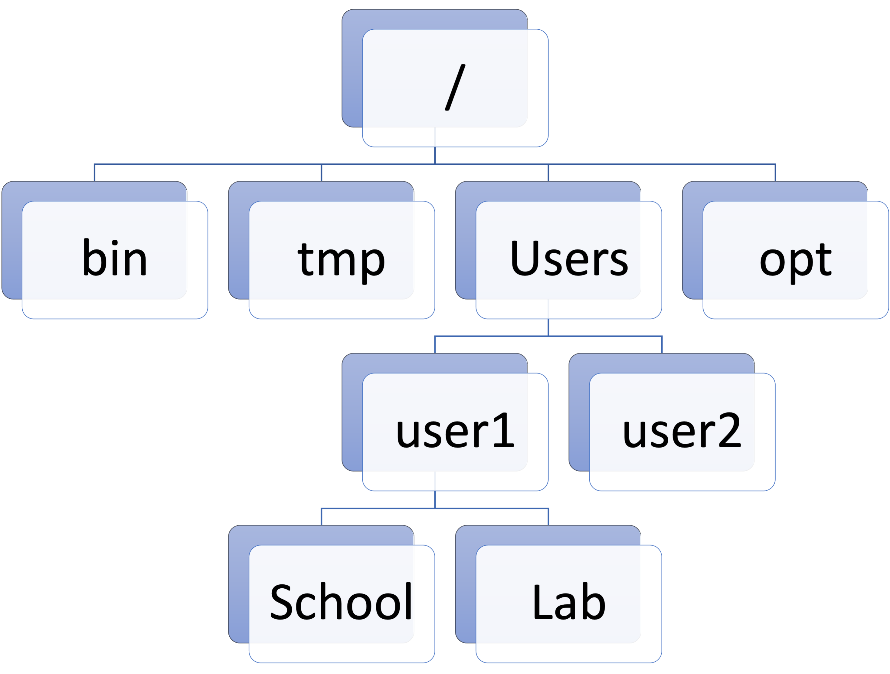
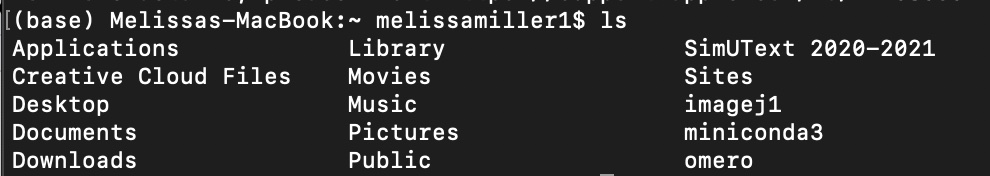
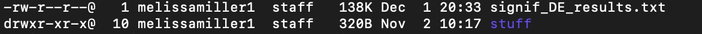

The Command Line
================

-   [Overview](#overview)
    -   [Opening the Command Line](#opening-the-command-line)
    -   [Navigating Paths](#navigating-paths)
    -   [The Anatomy of a Command](#the-anatomy-of-a-command)
        -   [Note: What `ls -lh` tells you](#note-what-ls--lh-tells-you)
    -   [Common Commands](#common-commands)
    -   [Simple Tricks for Navigating Files and
        Directories](#simple-tricks-for-navigating-files-and-directories)
-   [Additional Resources](#additional-resources)
-   [What to Do Now](#what-to-do-now)

## Overview

The command line, usually “Terminal” on Mac and “Command Prompt” on
Windows, allows you to interact directly with your computer; you
“command” your computer to execute certain functions. You can browse,
create, and delete files and folders, pull information out of files, run
code, and much more, all by typing out simple phrases in the command
line. There are also plenty of safeguards to make sure you don’t
accidentally use a command that will irreparably harm your computer.
**Please note:** most of the following is specific to Mac with an Intel
chip. Windows has a few differences, but the core concepts are the same.
If you have a Windows machine and have questions or difficulty, please
feel free to reach out.

### Opening the Command Line

When you first open your command line, it will immediately give you some
basic information: <!-- -->

-   `(base)` on the far left means that you are in your “base
    environment”. You can find [more information on environments
    here](Anaconda.md). For now, just consider this a default space with
    basic capabilities already built in.
-   The next line, where mine says `Melissas-MacBook:`, lists the name
    of your computer. When you work in [a computing cluster like
    Discovery](Discovery_HPC.md), this becomes more relevant. More
    generally, this is the personal computer hardware you are using
    right now.
-   The `~` symbol is a shortcut to indicate that you are in a folder
    specific to you, the user, for which you have certain permissions
    that you don’t have in other users’ folders. Again this will become
    more relevant when working on a computing cluster, assuming you are
    the only user on your personal computer.
-   Following `~` is the name of the current user, for me
    `melissamiller1`. On a computing cluster, you are only ever able to
    access the cluster using the username linked to your computer
    through a unique ID.
-   Finally, the `$` (sometimes `>`, `%`, or `#` on other systems)
    indicates the start of where you can type commands. In any code
    blocks from here on out, anywhere a line of code begins with `$`
    means that it should be run directly through the command line and
    not in a program script. Don’t include the `$` when typing a
    command.

### Navigating Paths

**From here:** Windows commands are often different from those on a Mac,
so please reference [the section on common commands](#common-commands)
for the equivalent commands for using a Windows Command Prompt.
Additionally, if you are reading this as a Windows user, I encourage you
to look at the `help` pages for those commands to understand argument
construction on a Windows system. It is also possible as a Windows user
to [install a command line that supports
Unix](Discovery_HPC.md#logging-in-to-discovery-using-windows) (i.e., the
commands used by Mac that you will see below).

You are likely familiar with the difference between “files” and
“folders” on a computer system. A file is a single item, like a document
or an image. A folder can hold multiple files and other folders, and you
can nest folders inside of one another as much as you want. In
programmer speak, a folder is called a *directory*. Each directory, like
folders, can hold multiple files and other directories. Open your
command line and type the following (without the `$`), then hit enter:

``` bash
$ pwd
```

Congrats! You’ve used a command. `pwd` stands for “print working
directory”, otherwise known as “tell me what folder I’m in right now”.
If you saw `~` above in your command line, you likely received an output
similar to this (with `\` instead of `/` and a drive like `D:` or `C:`
if you’re using Windows):

> `/Users/<username>/`

or

> `/home/<username>/`

This is what’s called the *absolute path* of a directory. The absolute
path spells out every single parent folder all the way to the one you
are currently in. The first `/` (or `\`) represents what’s called the
*root* directory. From the root you can access any other lower directory
that you have access permission to. This visual might help:
<!-- -->

A *relative path*, in contrast to the absolute path, takes a few
shortcuts. The `~`, just [like you saw
above](#opening-the-command-line), is an example of a relative path,
because it’s shorthand for three directories: the root, the “users”
directory or some equivalent, *and* your specific user home directory.
It’s often acceptable to write a code using the relative path, but to be
extra careful that you’re in the right place, it’s sometimes better to
use the absolute path. You can always use `pwd` to see the absolute path
to where you are. For example, if I am in the `Desktop` directory on my
computer (one directory lower than my user directory `melissamiller1`),
the absolute path would be:

> `/Users/melissamiller1/Desktop`

While the relative path would be:

> `~/Desktop`

You can’t move horizontally in a directory tree. That is, in the above
tree, you can’t move directly from `Users` to `opt`. In order to change
to `Users` from `opt`, you must use the absolute path including the
root, i.e., `/Users` or `/opt` (See [common commands](#common-commands)
for how to change directories).

### The Anatomy of a Command

Before you see some commands which are the ones you’ll use most
frequently, it’s important to understand what the computer is reading
and interpreting. Here is an example **Mac** command `ls` to break this
down. `ls` lists the contents of a directory. Try using `ls` in your
command line:

``` bash
$ ls
```

Your output should be your different directories and files listed side
by side, like this:

<!-- -->

But what if you want to see more information about each file? What if
you wanted to see the output in a certain format? You can add
*arguments* to do this. When you give a command, you’re telling your
computer to do a certain thing. When you add arguments, you’re telling
the computer to execute the command in a certain way. Arguments in the
command line are often flagged by `-` or `--`. Let’s see some common
arguments for `ls`. Try:

``` bash
$ ls -l
```

Suddenly there’s much more information shown about your files and
directories. So the `-l` tells `ls` to list the directory’s contents in
long form. Other arguments do different things. Try `ls -lh` next:

``` bash
$ ls -lh
```

Now you can hopefully see that the numbers directly left of your file
names have changed into human readable digits - that is, in terms of the
sizes you might be familiar with (KB, MB, GB, etc.). So to summarize,
you have your base commands like `pwd` and `ls`, but these commands can
often be modified with arguments in order to further specify how to
execute your command. Commands like `ls` are convenient in that all of
your different flags can be combined behind one `-`, but if you used
multiple flags like `$ ls -l -h`, you will get the same output.

But what if you don’t know what flag to use for what you want? Try this
command on Mac:

``` bash
$ man ls
```

You should get a full page of text telling you how to use `ls`. This is
because `man` stands for *manual*. All of your base commands come with a
manual page built in. Some commands, usually installed packages rather
than base commands, instead use a `--help` or `-h` flag to give the same
information. Hit `q` to quit the `man` page. Play around with the
different flags of `ls`; what happens if you use something like
`ls -lrt` or `ls -a`?

#### Note: What `ls -lh` tells you

Run `ls -lh` in your command line. You should get a long form list of
files with human readable sizes. But what information is in this list?

<!-- -->

Let’s break down what these columns mean:

-   Column 1 shows the *permissions* for each file or directory. These
    permissions are for reading, writing, and executing for users,
    groups, and ‘world’. For now, permissions are beyond our scope. But
    what is important to note is that, where the `signif_DE_results.txt`
    file has a `-`, the `stuff` directory has a `d` indicating that it
    is a directory and not a file.
-   Column 2 shows the number of items in that file or directory. Files
    will always be 1, because they are a single file. Directories like
    `stuff` might have 0, 1, or any other number.
-   Column 3 shows the user who owns that file or directory. On your
    computer, this will always be you as long as there aren’t other
    users. In a remote cluster like Discovery, this could be different,
    and it’s likely that you will not have any sort of access to other
    users’ content.
-   Column 4 indicates the level of that user. On my personal computer,
    I’m `staff`, which more or less indicates that I have total
    permissions within that user group. In a cluster like Discovery, I’m
    just a `user`.
-   Column 5 indicates the size of that file or directory, and assuming
    you used the `-h` flag, it will be in some format of `B` for
    `bytes`, `K` for `kilobytes`, and so on. But if `stuff` is a
    directory with ten items, why is it only `320B`? Directories can be
    strange sometimes in that the size of its metadata is shown, rather
    than the combined actual size of each file; additionally, `stuff`
    contains further directories. So the total size of the items in
    `stuff` is much greater than `320B`, but the directory size still
    reads as only `320B`.
-   Columns 6/7/8 show the date that that file or directory was *created
    or most recently modified*. This can be annoying if you’re trying to
    find something that was created on a certain date, but moved to a
    new location at a different time, because this date will reflect
    when that file was moved rather than created.
-   Column 9, finally, shows the name of the file or directory.

Your files might not have any colors at all, and this can be difficult
to read if you have directories with many different things in them. If
you want help making your command line colorful, let me know :)

### Common Commands

|           Mac            |          Windows           |                      What it does                       |
|:------------------------:|:--------------------------:|:-------------------------------------------------------:|
|          `pwd`           |            `cd`            |                prints working directory                 |
|     `cd <directory>`     |        same as Mac         |                  move to `<directory>`                  |
|           `ls`           |           `dir`            |              list contents of a directory               |
|   `mkdir <directory>`    |        same as Mac         |      create `<directory>` within working directory      |
|      `less <file>`       |        same as Mac         |        view contents of `<file>` (exit with `q`)        |
|       `rm <file>`        |        `del <file>`        |             **permanently** remove `<file>`             |
|   `rmdir <directory>`    |        same as Mac         |     **permanently** remove an *empty* `<directory>`     |
| `mv <target> <location>` | `move <target> <location>` | move `<target>` file *or* directory to new `<location>` |
| `mv <target> <location>` | `ren <target> <location>`  |  rename `<target>` file *or* directory to `<location>`  |
|     `man <command>`      |      `help <command>`      |          displays manual page for `<command>`           |
| `cp <target> <location>` | `copy <target> <location>` |  copy `<target>` file or directory to new `<location>`  |
|         `clear`          |           `cls`            |      clear screen (this does not delete anything!)      |

------------------------------------------------------------------------

Windows command arguments are a little different from arguments on a
Mac, so if you are using Windows I encourage you to look at some of the
`help` pages. Otherwise, whether Mac or Windows, play around with some
of these commands until you get the hang of them and navigating your
file system. **Use caution** with `rm`, `del`, and `rmdir`, because
these commands will **permanently** delete files and directories, not
just move them to the trash bin. If you use these commands, make sure
they’re things you actually want to delete!

You might not think of command line commands as a scripting language
like Python or R, but it *is* actually a language called `bash` or
“shell”, at least on Unix systems like Mac. So using command line
commands, like other languages, takes plenty of practice in order to
become “fluent”. Fun fact: shell script is as close as you can get to
“speaking” in pure computer language (which is just binary).

If you want to create a test file to practice with commands, use:

> **Mac:** `$ echo 'Practice' > practice.txt`

> **Windows:** `$ echo Practice >> practice.txt`

### Simple Tricks for Navigating Files and Directories

-   `.` is your current directory (the output of `pwd`). So if you
    `$ cp <file> .`, `<file>` will be copied to the current directory.
-   `..` is one directory above the working directory. So if you
    `$ cd ..`, you’ll move up one level in the directory tree.
    Similarly, `$ ls ..` will list the contents of the directory one
    level up, *not* the working directory.
-   You can also combine `..`. Running `$ cd ../..` will move you up
    *two* levels, `$ cd ../../..` up three levels, and so on. There is
    no equivalent for moving down. You can also use something like
    `$ cp ../<file> .` to copy a file from one level up to the working
    directory.
-   If you partially type in a file or directory name, hitting `tab`
    will either fill it in the rest of the way or display a list of
    files and directories matching that pattern. This makes avoiding
    typos much easier and faster.
-   `CTRL+C` will kill a running command. I use this when I run
    something I didn’t mean to or if I see midway through that the
    output is incorrect.
-   Use the up and down arrows on your keyboard to scroll through recent
    commands.

## Additional Resources

-   [Codecademy Cheatsheet: Learn the Command
    Line](https://www.codecademy.com/learn/learn-the-command-line/modules/learn-the-command-line-navigation/cheatsheet)
-   [Scrapism Intro to the Command
    Line](https://scrapism.lav.io/intro-to-the-command-line/)
-   [freeCodeCamp: Command Line Crash Course (35
    mins)](https://www.youtube.com/watch?v=yz7nYlnXLfE)
-   [thenewboston Windows Command Line Tutorial 1 (7.5
    mins)](https://youtu.be/MBBWVgE0ewk), also has a playlist of more
    tutorials
-   [CrashCourse: Keyboards & Command Line Interfaces (11
    mins)](https://youtu.be/4RPtJ9UyHS0)

## What to Do Now

Practice with navigating your command line until you feel comfortable
with it. This introduction alone is *by far* the steepest part of the
learning curve of programming, so don’t hesitate to reach out to me if
you want extra help.
