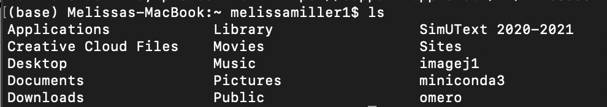

The Command Line and Vim Text Editor
================

-   [Overview](#overview)
-   [The Command Line](#the-command-line)
    -   [Opening the Command Line](#opening-the-command-line)
    -   [Navigating Paths](#navigating-paths)
    -   [The Anatomy of a Command](#the-anatomy-of-a-command)
        -   [Note: What `ls -lh` tells you](#note-what-ls--lh-tells-you)
    -   [Common Commands](#common-commands)
    -   [Simple Tricks for Navigating Files and
        Directories](#simple-tricks-for-navigating-files-and-directories)
-   [Vim Text Editor](#vim-text-editor)
    -   [Accessing Vim](#accessing-vim)
    -   [Navigating Vim](#navigating-vim)
        -   [Normal Mode](#normal-mode)
            -   [Moving around your file](#moving-around-your-file)
            -   [Other commands](#other-commands)
        -   [Insert Mode](#insert-mode)
        -   [Command Mode](#command-mode)
        -   [Note: `.swp` Files](#note-swp-files)
    -   [Basics in Writing Code with
        Vim](#basics-in-writing-code-with-vim)
        -   [Note: File Extensions](#note-file-extensions)
-   [Additional Resources](#additional-resources)
-   [What to Do Now](#what-to-do-now)

## Overview

This introduction is for users who may have never used a command line.
[The Command Line](#the-command-line) section covers the basics of
navigating the interface and common commands for interacting with your
computer. [The Vim Text Editor](#vim-text-editor) section introduces a
simple software for writing and executing code scripts.

## The Command Line

### Opening the Command Line

The command line, usually “Terminal” on Mac and “Command Prompt” on
Windows, allows you to interact directly with your computer; you
“command” your computer to execute certain functions. You can browse,
create, and delete files and folders, pull particular information out of
files, run code, and much more, all by typing out simple phrases through
the command line. There are also plenty of safeguards to make sure you
don’t accidentally use a command that will irreparably harm your
computer. **Please note:** much of the following will be specific to Mac
with an Intel chip. Windows has a few differences, but the core concepts
are the same. If you have a Windows machine and have questions or
difficulty, please feel free to reach
out.

When you first open your command line, it will immediately give you some
basic information: <!-- -->

-   `(base)` on the far left means that you are in your “base
    environment”. You can find [more information on environments
    here](Anaconda.md). For now, just consider this a default space with
    basic capabilities already built in.
-   The next line, where mine says `Melissas-MacBook:`, lists the name
    of your computer. When you work in [a computing cluster like
    Discovery](Discovery_HPC.md), this becomes more relevant. More
    generally, this is the personal computer hardware you are using
    right now.
-   The `~` symbol is a shortcut to indicate that you are in a folder
    specific to you, the user, for which you have certain permissions
    that you don’t have in another user’s folders. Again this will
    become more relevant when working on a computing cluster, assuming
    you are the only user on your personal computer.
-   Following `~` is the name of the current user, for me
    `melissamiller1`. On a computing cluster, you are only ever able to
    access the cluster using the username linked to your computer
    through a unique ID.
-   Finally, the `$` (sometimes `>`, `%`, or `#` on other systems)
    indicates the start of where you can type commands. In any code
    blocks from here on out, anywhere a line of code begins with `$`
    means that it should be run directly through the command line and
    not in a program script. Don’t include the `$` when typing a
    command.

### Navigating Paths

**From here:** Windows commands are often different from those on a Mac,
so please reference [the section on common commands](#common-commands)
for the equivalent commands for using a Windows Command Prompt.
Additionally, if you are reading this as a Windows user, I encourage you
to look at the help pages for those commands to understand argument
construction on a Windows system. It is also possible as a Windows user
to [install a command line that supports
Unix](Discovery_HPC.md#logging-in-to-discovery-using-windows) (i.e., the
commands used by Mac that you will see below).

You are likely familiar with the difference between “files” and
“folders” on a computer system. A file is a single item, like a document
or an image. A folder can hold multiple files and other folders, and you
can nest folders inside of one another as much as you want. In
programmer speak, a folder is called a *directory*. Each directory, like
folders, can hold multiple files and other directories. Open your
command line and type the following (without the `$`), then hit enter:

``` bash
$ pwd
```

Congrats, you’ve used a command. `pwd` stands for “print working
directory”, otherwise known as “tell me what folder I’m in right now”.
If you saw `~` above in your command line, you likely received an output
similar to this (with `\` instead of `/` and a drive like `D:` or `C:`
if you’re using Windows):

> `/Users/<username>/`

or

> `/home/<username>/`

This is what’s called the *absolute path* of a directory. The absolute
path spells out every single parent folder all the way to the one you
are currently in. The first `/` (or `\`) represents what’s called the
*root* directory. From the root you can access any other lower directory
that you have access permission to. This visual might help:
<!-- -->

A *relative path*, in contrast to the absolute path, takes a few
shortcuts. The `~` above, just [like you saw
above](#opening-the-command-line), is an example of a relative path,
because it’s shorthand for three directories: the root, the “users”
directory or some equivalent, *and* your specific user home directory.
It’s often acceptable to write a code using the relative path, but to be
extra careful that you’re in the right place, it’s sometimes better to
use the absolute path. You can always use `pwd` to see the absolute path
to where you are. For example, if I am in the `Desktop` directory on my
computer (one directory lower than my user directory `melissamiller1`),
the absolute path would be:

> `/Users/melissamiller1/Desktop`

While the relative path would be:

> `~/Desktop`

You can’t move horizontally in a directory tree. That is, in the above
tree, you can’t move directly from `Users` to `opt`. In order to change
to `Users` from `opt`, you must use the absolute path including the
root, i.e., `/Users` or `/opt` (See [common commands](#common-commands)
for how to change directories).

### The Anatomy of a Command

Before you see some commands which are the ones you’ll use most
frequently, it’s important to understand what the computer is reading
and interpreting. Here is an example **Mac** command `ls` to break this
down. `ls` lists the contents of a directory. Try using `ls` in your
command line:

``` bash
$ ls
```

Your output should be your different directories and files listed side
by side, like this:

<!-- -->

But what if you want to see more information about each file? What if
you wanted to see the output in a certain format? You can add
*arguments* to do this. When you give a command, you’re telling your
computer to do a certain thing. When you add arguments, you’re telling
the computer to execute the command in a certain way. Arguments in the
command line are often (but not always!) flagged by `-` or `--`. Let’s
see some common arguments for `ls`. Try:

``` bash
$ ls -l
```

Suddenly there’s much more information shown about your files and
directories. So the `-l` tells `ls` to list the directory’s contents in
long form. Other arguments do different things. Try `ls -lh` next:

``` bash
$ ls -lh
```

Now you can hopefully see that the numbers directly left of your file
names have changed into human readable digits - that is, in terms of the
sizes you might be familiar with (KB, MB, GB, etc.). So to summarize,
you have your base commands like `pwd` and `ls`, but these commands can
often be modified with arguments in order to further specify how to
execute your command. Commands like `ls` are convenient in that all of
your different flags can be combined behind one `-`, but if you used
multiple flags like `$ ls -l -h`, you will get the same output.

But what if you don’t know what flag to use for what you want? Try this
command on Mac:

``` bash
$ man ls
```

You should get a full page of text telling you how to use `ls`. This is
because `man` stands for *manual*. All of your base commands come with a
manual page built in. Some commands, usually installed packages rather
than base commands, instead use a `--help` or `-h` flag to give the same
information. Hit `q` to quit the `man` page. Play around with the
different flags of `ls`; what happens if you use something like
`$ ls -lrt` or `$ ls -a`?

#### Note: What `ls -lh` tells you

Run `$ ls -lh` in your command line. You should get a long form list of
files with human readable sizes. But what information is in this list?

<!-- -->

Let’s break down what these columns mean:

-   Column 1 shows the *permissions* for each file or directory. These
    permissions are for reading, writing, and executing for users,
    groups, and ‘world’ (literally, anyone in the world). For now,
    permissions are beyond our scope. But what is important to note is
    that, where the `signif_DE_results.txt` file has a `-`, the `stuff`
    directory has a `d` indicating that it is a directory instead of a
    file.
-   Column 2 shows the number of items in that file or directory. Files
    will always be 1, because they are a single file. Directories like
    `stuff` might have 0, 1, or any other number.
-   Column 3 shows the user who owns that file or directory. On your
    computer, this will always be you as long as there aren’t other
    users. In a remote cluster like Discovery, this could be different,
    and it’s likely that you will not have any sort of access to other
    users’ content.
-   Column 4 indicates the level of that user. On my personal computer,
    I’m `staff`, which more or less indicates that I have total
    permissions within that user group. In a cluster like Discovery, I’m
    just a `user`.
-   Column 5 indicates the size of that file or directory, and assuming
    you used the `-h` flag, it will be in some format of `B` for
    `bytes`, `K` for `kilobytes`, and so on. But if `stuff` is a
    directory with ten items, why is it only `320B`? Directories can be
    strange sometimes in that the total size of the titles of each item
    is shown, rather than the actual size of each; additionally, `stuff`
    contains further directories. So the total size of the items in
    `stuff` is much greater than `320B`, but the directory size still
    reads as only `320B`.
-   Columns 6/7/8 show the date that that file or directory was *created
    or most recently modified*. This can be annoying if you’re trying to
    find something that was created on a certain date, but moved to a
    new location at a different time, because this date will reflect
    when that file was moved rather than created.
-   Column 9, finally, shows the actual name of the file or directory.

Your files might not have any colors at all, and this can be difficult
to read if you have directories with many different things in them. If
you want help making your command line colorful, let me know :)

### Common Commands

|           Mac            |          Windows           |                      What it does                       |
|:------------------------:|:--------------------------:|:-------------------------------------------------------:|
|          `pwd`           |            `cd`            |                prints working directory                 |
|     `cd <directory>`     |        same as Mac         |                  move to `<directory>`                  |
|           `ls`           |           `dir`            |              list contents of a directory               |
|   `mkdir <directory>`    |        same as Mac         |      create `<directory>` within working directory      |
|      `less <file>`       |        same as Mac         |        view contents of `<file>` (exit with `q`)        |
|       `rm <file>`        |        `del <file>`        |             **permanently** remove `<file>`             |
|   `rmdir <directory>`    |        same as Mac         |     **permanently** remove an *empty* `<directory>`     |
| `mv <target> <location>` | `move <target> <location>` | move `<target>` file *or* directory to new `<location>` |
| `mv <target> <location>` | `ren <target> <location>`  |  rename `<target>` file *or* directory to `<location>`  |
|     `man <command>`      |      `help <command>`      |          displays manual page for `<command>`           |
| `cp <target> <location>` | `copy <target> <location>` |  copy `<target>` file or directory to new `<location>`  |
|         `clear`          |           `cls`            |      clear screen (this does not delete anything!)      |

------------------------------------------------------------------------

Windows command arguments are a little different from arguments on a
Mac, so if you are using Windows I encourage you to look at some of the
`help` pages. Otherwise, whether Mac or Windows, play around with some
of these commands until you get the hang of them and navigating your
file system. **Use caution** with `rm`, `del`, and `rmdir`, because
these commands will **permanently** delete files and directories, not
just move them to the trash bin. If you use these commands, make sure
they’re things you actually want to delete!

You might not think of command line commands as a scripting language
like Python or R, but it *is* actually a language called `bash` or
“shell”, at least on Unix systems like Mac. So using command line
commands, like other languages, takes plenty of practice in order to
become “fluent”. Fun fact: shell script is as close as you can get to
“speaking” in pure computer language (which is just binary).

Before I introduce Vim, if you want to create a test file to practice
with commands, use:

> **Mac:** `$ echo 'Practice File' > practice.txt`

> **Windows:** `$ echo Practice File >> practice.txt`

### Simple Tricks for Navigating Files and Directories

-   `.` is your working directory. So if you `$ cp <file> .`, `<file>`
    will be copied to the working directory.
-   `..` is one directory above the working directory. So if you
    `$ cd ..`, you’ll move up one level in the directory tree.
    Similarly, `$ ls ..` will list the contents of the directory one
    level up, *not* the working directory.
-   You can also combine `..`. Running `$ cd ../..` will move you up
    *two* levels, `$ cd ../../..` up three levels, and so on. There is
    no equivalent for moving down. You can also use something like
    `$ cp ../<file> .` to copy a file from one level up to the working
    directory.
-   If you partially type in a file or directory name, hitting `tab`
    will either fill it in the rest of the way or display a list of
    files and directories matching that pattern. This makes avoiding
    typos much easier and faster.
-   `CTRL+C` will kill a running command. I use this when I run
    something I didn’t mean to or if I see midway through that the
    output is incorrect.
-   Use the up and down arrows on your keyboard to scroll through recent
    commands.

## Vim Text Editor

Vim is a simple *text editing* software that allows you to edit many
different kinds of files, including script files of most languages. Vim
comes pre-installed on most Macs, but if you don’t have it on your
Windows system visit the [Vim website](https://www.vim.org) to download
and install Vim. It is straightforward to download and install Vim, but
[contact me](mailto:miller.me@northeastern.edu) if you want help with
this, because it’s important that Vim is installed in the right place.

See if Vim is installed:

> **Mac:** `$ which vim`

> **Windows:** `$ where vim`

You should receive something like `/usr/bin/vim` or similar.

For the beginner programmer, Vim can be more difficult when it comes to
understanding what is happening when you write programs outside of the
command line, because there may not be any visual output. For that
reason, I recommend [Jupyter Notebook](Jupyter_Notebook.md) if you’re
trying to practice your language skills but not doing anything that
requires a whole lot of computational power.

So why use Vim? The utility of Vim is that it is easily accessed from
the command line, just by typing `$ vim <filename>` to create a file or
open an existing file. From there, it is very simple to edit your file,
and if it’s a script file, to execute it from your command line.
Additionally, like I said earlier, Vim allows you to edit tons of
different file types. A *word processor* on the other hand, like
Microsoft Word or Apple Pages, encodes files such that you may only
open, edit, and save those kinds of files. Vim has nothing fancy - no
special fonts, no italics, and most importantly, no particular file
encoding. The only thing you will see in Vim is coloration specific to
the language you are using and occasional bold text, if it’s a script
file. This coloration also doesn’t always come built in, so ask me if
you want help making Vim colorful.

If you want to learn Vim but are bored with command line work, you can
play [Vim Adventures](https://vim-adventures.com) (definitely still
practice in your command line though).

### Accessing Vim

To start Vim on a particular file, all you need to do is type
`$ vim <filename>` in your command line and hit `enter`. For a practice
file, try:

``` bash
$ vim vim_practice.txt
```

### Navigating Vim

Vim has five modes: Normal, Insert, Command, Visual, and Replace. I will
only be covering Normal, Insert, and Command modes, as these are the
ones you’ll use most often and which will do the majority of the things
you’ll need in Vim.

##### Normal Mode

You first open Vim in normal mode. When you’re in the other modes, you
can return to normal by hitting the `escape` key. Normal mode doesn’t
allow you to do any text insertion, but you can use a few keyboard
tricks to do some basic editing.

###### Moving around your file

-   `h` or the left arrow will move one character left.
-   `l` or the right arrow will move one character right.
-   `k` or the up arrow will move one line up.
-   `j` or the down arrow will move one line down.

These commands can be combined with numbers. For example, `4j` will move
down four lines, and `5k` will move up five lines.

-   `b` moves to the beginning of the current word.

-   `e` moves to the end of the current word.

-   `w` moves to the beginning of the next word.

-   `0` moves to the beginning of the current line.

-   `$` moves to the end of the current line.

-   `gg` moves to the beginning of the file.

-   `G` moves to the bottom of the file.

###### Other commands

-   `dd` deletes the entire current line.

-   `u` undoes the last command. You can use this multiple times in a
    row.

-   `.` will repeat the last command.

-   `/<text>` lets you search for text matching `<text>`.

-   `%` will search for the entire word the cursor is on and highlight
    it. This is useful for finding key words and making sure things like
    variables are all spelled correctly.

There are many more commands you can run in normal mode, but these are
the most common.

##### Insert Mode

Insert mode is where you can actually edit your text file beyond the
simple normal mode commands. To enter insert mode, hit `i`, and
`--Insert--` will show up in the bottom line of your screen.

There are no tricks in insert mode, just moving around or inserting and
deleting text one character at a time. To navigate your file or delete
text more than one character at a time, you need to be in normal mode.
To re-enter normal mode, just hit the `escape` key. You can easily jump
back and forth between insert mode and normal mode using `i` and
`escape`. Because of the normal mode editing capability like the
commands listed above, you can do some unintended editing if you don’t
realize you’re in normal mode.

##### Command Mode

Command mode can be accessed from normal mode using `:`. As the name
suggests, command mode allows you to execute certain commands on your
file. Here are some of them:

-   `:w` saves your file. Save frequently throughout your session, and
    **ALWAYS** save your file before exiting Vim.
-   `:q` exits Vim. Using `:wq` will save and then exit.
-   `:q!` exits Vim without saving the file. This will not create a
    `.swp`, but it **will** undo any changes you’ve made since your last
    save.
-   `:set number` will show the line numbers. This does not add them to
    the file.
-   `:set nonumber` will hide the line numbers. This does not remove
    anything from the file.

#### Note: `.swp` Files

Hopefully I’ve made it clear that you should always save your file
before exiting Vim. But why? Or what if the WiFi crashes before you have
a chance to save?

Exiting Vim without saving (aside from using `:q!`) will create a `.swp`
file. It is essentially a duplicate of your file that allows you to
recover the work that has been done. This won’t blow up your computer,
but it is annoying to deal with and could lead to losing the progress
you made on your file. If a `.swp` file is created, the next time you
open that file with Vim, you’ll get a message like this:

<!-- -->

Follow the instructions shown. If you made changes to a file you want to
recover that didn’t save, hit `r`. If you didn’t make any changes or
don’t want to keep them, hit `d`. This message will pop up until you fix
the issue.

### Basics in Writing Code with Vim

Vim is powerful in that you can write code files in many different
languages. The way that your computer knows which language to use is
established by a special line in the first line of your file. Files that
aren’t programming, like `.txt` files, don’t have this line, because the
computer doesn’t execute them. It’s called the *shebang line* and it’s
something like this:

``` bash
#!/usr/bin/bash
```

The above shebang line indicates that the following code is in `bash`
script, and tells the computer to follow the `/usr/bin/`
[path](#navigating-paths) to find the language. To write in Python or R,
it might look like:

``` bash
#!/usr/bin/python
```

or

``` bash
#!/usr/bin/Rscript
```

Make sure the path to the language is correct, otherwise you’ll receive
an error. Any code in the file must be in the language you’ve chosen.
Let’s write and execute a simple `bash` script using Vim (**on Mac**).

First, check the path to your language:

``` bash
$ which bash
```

My output is `/bin/bash`, but yours might be a little different. This is
the path you’ll put in the shebang line.

Next, create your practice file and open the Vim interface:

``` bash
$ vim hello_world.sh
```

Hit `i` to enter insert mode. Enter the following:

``` bash
#!/bin/bash

echo 'Hello, world!'
```

Remember that the shebang line should be the path you saw earlier when
you used `$ which vim`, not necessarily `#!/bin/bash` like I have here.
Now use `:wq` to save and exit Vim. To execute our function, first we
need to give the computer permission to execute it:

``` bash
$ chmod u+x hello_world.sh
```

The `chmod` command is used to change permissions, and `u+x` means that,
for `u` (user) you are `+` (adding) `x` (execute) permission to the
`hello_world.sh` file. Now it’s time to run it!

``` bash
# Note the './' indicating that this script is in the working directory. 
./hello_world.sh
```

    ## Hello, world!

Voila! Those are the steps you need to take to write and execute a code
with Vim.

##### Note: File Extensions

You are probably already familiar with some file extensions, like
`.docx` for Microsoft Word or `.ppt` for PowerPoint, or `.txt` for plain
text files. The `bash` file above had the extension `.sh`. This
indicates that it’s a shell script; other languages use their own
extensions, like `.py` for Python, `.R` for R, or `.pl` for Perl. The
nice part about something like Vim is that, because you have the shebang
line included, these extensions don’t actually matter all that much;
extensions make it easier to see what files you’re working with, but if
you had just named the above `hello_world` and executed it without a
`.sh` extension, it would run exactly the same. Here are some common
file extensions:

| Extension |                     File type                      |
|:---------:|:--------------------------------------------------:|
|  `.txt`   |                     plain text                     |
|   `.sh`   |                    shell script                    |
|   `.py`   |                   Python script                    |
|   `.R`    |                      R script                      |
| `.fasta`  |       a common biology DNA/RNA sequence file       |
| `.fastq`  |     a `.fasta` with “quality scores” attached      |
|  `.gtf`   |             a common genome file type              |
|  `.html`  |    a local file that opens in a browser window     |
|   `.md`   | a Markdown file…like the one you’re reading now :) |

## Additional Resources

-   [Codecademy Cheatsheet: Learn the Command
    Line](https://www.codecademy.com/learn/learn-the-command-line/modules/learn-the-command-line-navigation/cheatsheet)
-   [Scrapism Intro to the Command
    Line](https://scrapism.lav.io/intro-to-the-command-line/)
-   [freeCodeCamp: Command Line Crash Course (35
    mins)](https://www.youtube.com/watch?v=yz7nYlnXLfE)
-   [thenewboston Windows Command Line Tutorial 1 (7.5
    mins)](https://youtu.be/MBBWVgE0ewk), also has a playlist of more
    tutorials
-   [CrashCourse: Keyboards & Command Line Interfaces (11
    mins)](https://youtu.be/4RPtJ9UyHS0)

## What to Do Now

Practice with navigating your command line and Vim and maybe execute
some simple shell scripts (use `echo` to print out whatever you want)
until you feel comfortable with it. This introduction alone is the
“steepest” part of the learning curve of programming, so don’t
hesistate to reach out to me if you
want extra help.
