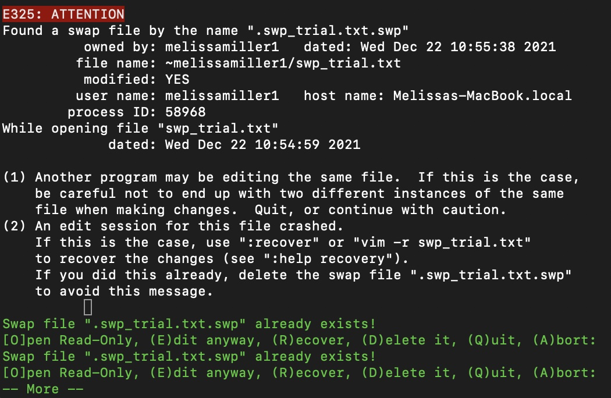

Vim Text Editor
================

-   [Overview](#overview)
    -   [Accessing vim](#accessing-vim)
    -   [Navigating vim](#navigating-vim)
        -   [Normal mode](#normal-mode)
            -   [Moving around your file](#moving-around-your-file)
            -   [Other commands](#other-commands)
        -   [Insert mode](#insert-mode)
        -   [Command mode](#command-mode)
        -   [Note: `.swp` files](#note-swp-files)
    -   [Basics in writing code with
        vim](#basics-in-writing-code-with-vim)
        -   [Note: file extensions](#note-file-extensions)
-   [Additional resources](#additional-resources)
-   [What to do now](#what-to-do-now)

## Overview

Vim is a simple *text editing* software that allows you to edit many
different kinds of files, including script files of most languages. Vim
comes pre-installed on most Macs, but if you don’t have it on your
Windows system visit the [Vim website](https://www.vim.org) to download
and install Vim. It is straightforward to download and install Vim, but
contact me if you want help with this, because it’s important that Vim
is installed in the right place.

See if Vim is installed:

> **Mac:** `$ which vim`

> **Windows:** `$ where vim`

You should receive something like `/usr/bin/vim` or similar.

For the beginner programmer, Vim can be more difficult when it comes to
understanding what is happening when you write programs outside of the
command line, because there may not be any visual output. For that
reason, I recommend [Jupyter Notebook](Jupyter_Notebook.md) if you’re
trying to practice your language skills or create visuals that you can
see in real time.

So why use Vim? The utility of Vim is that it is easily accessed from
the command line, just by typing `$ vim <filename>` to create a file or
open an existing file. From there, it is very simple to edit your file,
and if it’s a script file, to execute it from your command line.
Additionally, like I said earlier, Vim allows you to edit tons of
different file types. A *word processor* on the other hand, like
Microsoft Word or Apple Pages, encodes files such that you may only
open, edit, and save those kinds of files. Vim has nothing fancy - no
special fonts, no italics, and most importantly, no particular file
encoding. The only thing you will see in Vim is coloration specific to
the language you are using and occasional bold text, if it’s a script
file. This coloration also doesn’t always come built in, so ask me if
you want help making Vim colorful.

If you want to learn Vim but are bored with command line work, you can
play [Vim Adventures](https://vim-adventures.com) (definitely still
practice in your command line though).

### Accessing vim

To start Vim on a particular file, all you need to do is type
`$ vim <filename>` in your command line and hit `enter`. For a practice
file, try:

``` bash
$ vim vim_practice.txt
```

### Navigating vim

Vim has five modes: Normal, Insert, Command, Visual, and Replace. I will
only be covering Normal, Insert, and Command modes, as these are the
ones you’ll use most often and which will do the majority of the things
you’ll need in Vim.

##### Normal mode

You first open Vim in normal mode. When you’re in the other modes, you
can return to normal by hitting the `escape` key. Normal mode doesn’t
allow you to do any text insertion, but you can use a few keyboard
tricks to do some basic editing.

###### Moving around your file

-   `h` or the left arrow will move one character left.
-   `l` or the right arrow will move one character right.
-   `k` or the up arrow will move one line up.
-   `j` or the down arrow will move one line down.

These commands can be combined with numbers. For example, `4j` will move
down four lines, and `5k` will move up five lines.

-   `b` moves to the beginning of the current word.

-   `e` moves to the end of the current word.

-   `w` moves to the beginning of the next word.

-   `0` moves to the beginning of the current line.

-   `$` moves to the end of the current line.

-   `gg` moves to the beginning of the file.

-   `G` moves to the bottom of the file.

###### Other commands

-   `dd` deletes the entire current line.

-   `u` undoes the last command. You can use this multiple times in a
    row.

-   `.` will repeat the last command.

-   `/<text>` lets you search for text matching `<text>`.

-   `%` will search for the entire word the cursor is on and highlight
    it. This is useful for finding key words and making sure things like
    variables are all spelled correctly.

There are many more commands you can run in normal mode, but these are
the most common.

##### Insert mode

Insert mode is where you can actually edit your text file beyond the
simple normal mode commands. To enter insert mode, hit `i`, and
`--Insert--` will show up in the bottom line of your screen.

There are no tricks in insert mode, just moving around or inserting and
deleting text one character at a time. To navigate your file or delete
text more than one character at a time, you need to be in normal mode.
To re-enter normal mode, just hit the `escape` key. You can easily jump
back and forth between insert mode and normal mode using `i` and
`escape`. Because of the normal mode editing capability like the
commands listed above, you can do some unintended editing if you don’t
realize you’re in normal mode.

##### Command mode

Command mode can be accessed from normal mode using `:`. As the name
suggests, command mode allows you to execute certain commands on your
file. Here are some of them:

-   `:w` saves your file. Save frequently throughout your session, and
    **ALWAYS** save your file before exiting Vim.
-   `:q` exits Vim. Using `:wq` will save and then exit.
-   `:q!` exits Vim without saving the file. This will not create a
    `.swp`, but it **will** undo any changes you’ve made since your last
    save.
-   `:set number` will show the line numbers. This does not add them to
    the file.
-   `:set nonumber` will hide the line numbers. This does not remove
    anything from the file.

#### Note: `.swp` files

Hopefully I’ve made it clear that you should always save your file
before exiting Vim. But why? Or what if the WiFi crashes before you have
a chance to save?

Exiting Vim without saving (aside from using `:q!`) will create a `.swp`
file. It is essentially a duplicate of your file that allows you to
recover the work that has been done. This won’t blow up your computer,
but it is annoying to deal with and could lead to losing the progress
you made on your file if you’re not careful. If a `.swp` file is
created, the next time you open that file with Vim, you’ll get a message
like this:

<!-- -->

Follow the instructions shown. If you made changes to a file you want to
recover that didn’t save, hit `r`. If you didn’t make any changes or
don’t want to keep them, hit `d`. This message will pop up until you fix
the issue.

### Basics in writing code with vim

Vim is powerful in that you can write code files in many different
languages. The way that your computer knows which language to use is
established by a special line in the first line of your file. Files that
aren’t code files, like `.txt` files, don’t have this line, because the
computer doesn’t execute them. It’s called the *shebang line* and it’s
something like this:

``` bash
#!/usr/bin/bash
```

The above shebang line indicates that the following code is in `bash`
script, and tells the computer to follow the `/usr/bin/`
[path](#navigating-paths) to find the language. To write in Python or R,
it might look like:

``` bash
#!/usr/bin/python
```

or

``` bash
#!/usr/bin/Rscript
```

Make sure the path to the language is correct, otherwise you’ll receive
an error. Any code in the file must be in the language you’ve indicated
in the shebang line. Let’s write and execute a simple `bash` script
using Vim (**on Mac**).

First, check the path to your language:

``` bash
$ which bash
```

My output is `/bin/bash`, but yours might be a little different. This is
the path you’ll put in the shebang line.

Next, create your practice file and open the Vim interface:

``` bash
$ vim hello_world.sh
```

Hit `i` to enter insert mode. Enter the following:

``` bash
#!/bin/bash

echo 'Hello, world!'
```

Remember that the shebang line should be the path you saw earlier when
you used `which vim`, not necessarily `#!/bin/bash` like I have here.
Now use `:wq` to save and exit Vim. To execute our function, first we
need to give the computer permission to execute it:

``` bash
$ chmod u+x hello_world.sh
```

The `chmod` command is used to change permissions, and `u+x` means that,
for `u` (user) you are `+` (adding) `x` (execute) permission to the
`hello_world.sh` file. Now it’s time to run it!

``` bash
# Note the './' indicating that this script is in the working directory. 
./hello_world.sh
```

    ## Hello, world!

Voila! Those are the steps you take to write and execute a code with
Vim.

##### Note: file extensions

You are probably already familiar with some file extensions, like
`.docx` for Microsoft Word or `.ppt` for PowerPoint, or `.txt` for plain
text files. The `bash` file above had the extension `.sh`. This
indicates that it’s a shell script; other languages use their own
extensions, like `.py` for Python, `.R` for R, or `.pl` for Perl. The
nice part about something like Vim is that, because you have the shebang
line included, these extensions don’t actually matter all that much;
extensions make it easier to see what files you’re working with, but if
you had just named the above `hello_world` and executed it without a
`.sh` extension, it would run exactly the same. Here are some common
file extensions:

| Extension |                     File type                      |
|:---------:|:--------------------------------------------------:|
|  `.txt`   |                     plain text                     |
|   `.sh`   |                    shell script                    |
|   `.py`   |                   Python script                    |
|   `.R`    |                      R script                      |
| `.fasta`  |       a common biology DNA/RNA sequence file       |
| `.fastq`  |     a `.fasta` with “quality scores” attached      |
|  `.gtf`   |             a common genome file type              |
|  `.html`  |    a local file that opens in a browser window     |
|   `.md`   | a Markdown file…like the one you’re reading now :) |

## Additional resources

-   [Comprehensive vim documentation](https://vimhelp.org)
-   [Vim tips wiki](https://vim.fandom.com/wiki/Vim_Tips_Wiki)
-   [Vim tutorial for beginners (74
    mins)](https://www.youtube.com/watch?v=RZ4p-saaQkc)
-   [Vim crash course for beginners (30
    mins)](https://www.youtube.com/watch?v=jXud3JybsG4)

## What to do now

Practice! Make a text file (`.txt` extension) and practice with jumping
between the different modes, moving around the file, and entering and
deleting text. Vim is used extensively to write the code scripts for
things like RNA-Seq analysis, so it’s important to have a good grasp of
the interface even if you don’t know any programming languages.
